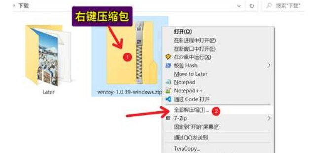
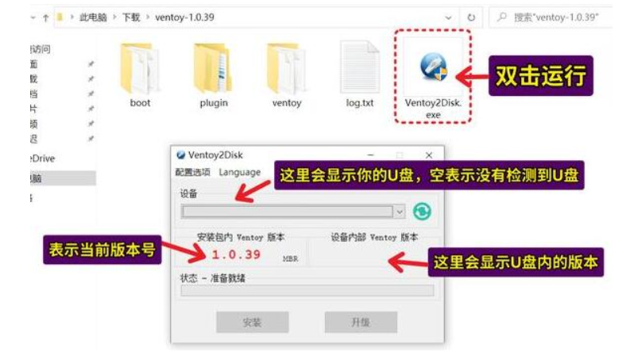
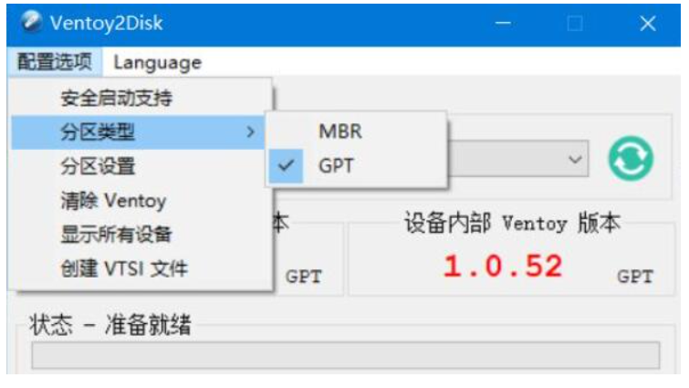
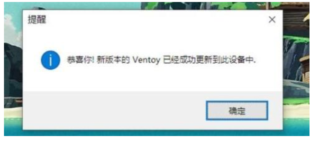
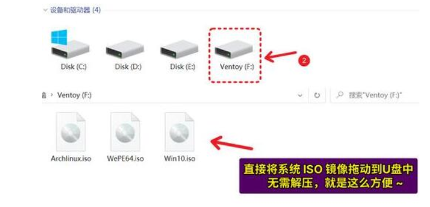

ventoy使用教程：

1、首先我们下载ventoy。【点击下载】 https://ventoy.net/cn/doc_start.html

2、下载完成会得到一个压缩包，将它解压出来。

 

 

3、解压完成后，双击运行“ventoy2disk.exe”打开它。

4、在上方选择我们想要制作成系统盘的u盘。（如果没有说明没插u盘）

 

 

5、接着点击图示位置修改配置版本。

（基本新电脑和系统都设置gpt就可以了）

 

 

6、设置完成后，点击“安装”就能完成系统盘的制作了。

 

 

7、这时候我们就能使用u盘启动电脑了。

8、如果要重装系统，那么只要下载想安装的系统镜像，将他放到u盘里就可以了。

