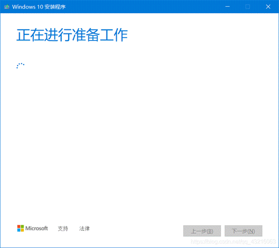
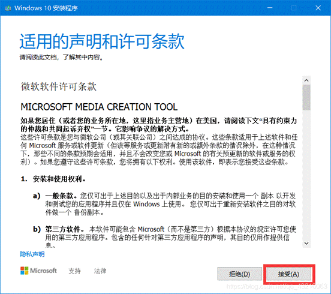
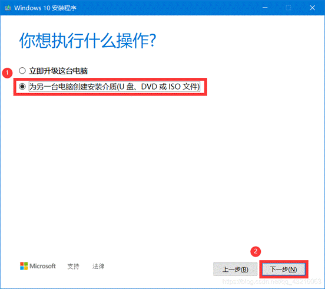
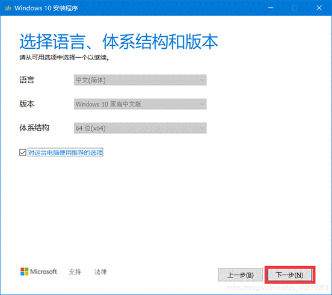
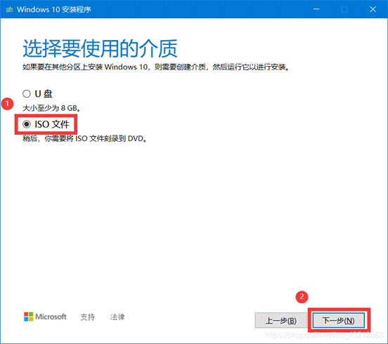
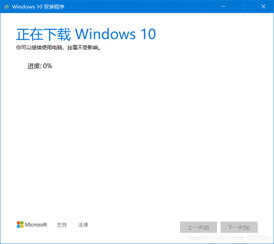
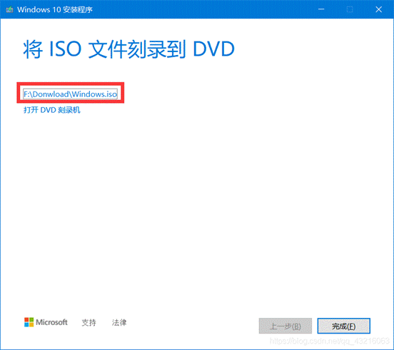

**下载系统镜像**

1.下载官网：https://www.microsoft.com/zh-cn/software-download/windows10

2.点击立即下载工具

   3.打开下载好的exe文件

  4.选择第2项，为另一台电脑创建安装介质

  5.可根据需求修改自己想要的版本

 6.选择ISO文件，点击下一步，选择下载路径

  7.选择下载的路径后，自动跳转下载如下图所示，速度有点慢，需耐心等待

8.打开之后就可以看到下载好的文件