**修复引导**

1.下载DiskGenius软件

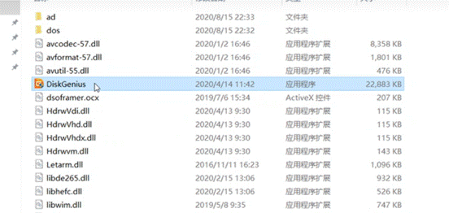

2.选择ESP（0）

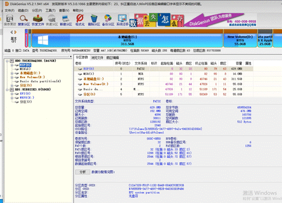

3.然后点击“浏览文件”，然后打开EFI文件夹

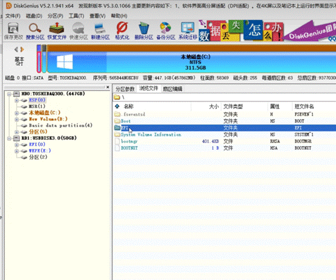

4.接着选择工具，点击“设置UEFI BIOS"启动项

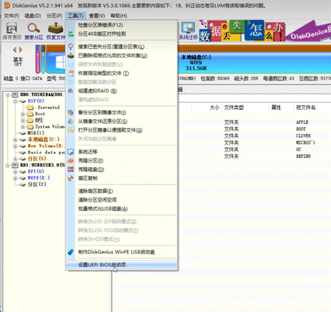

5.点击添加

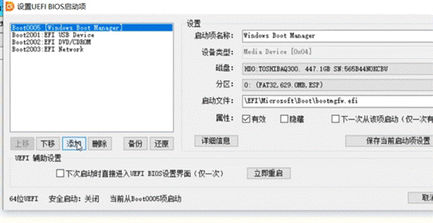

6.选择ESP（0）分区

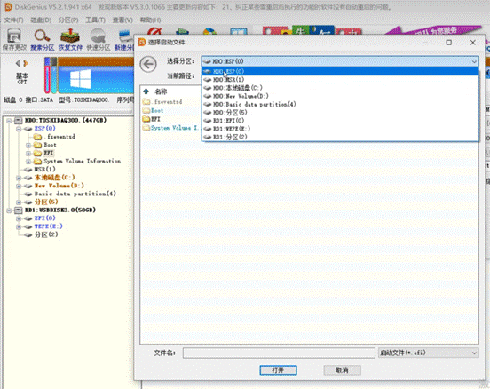

7.打开EFI文件

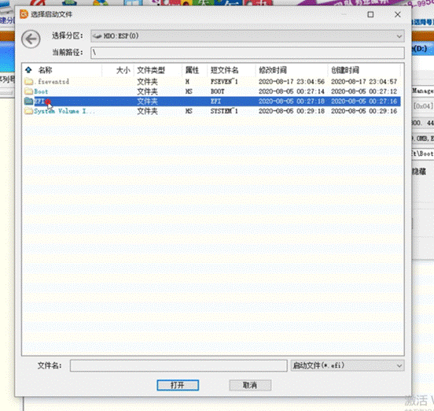

8.找到refind文件并打开

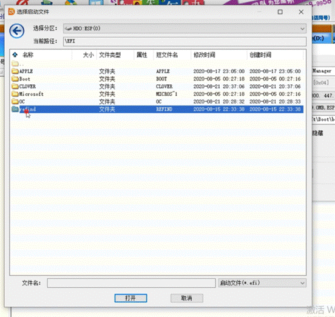

9.打开refind_x64.efi文件

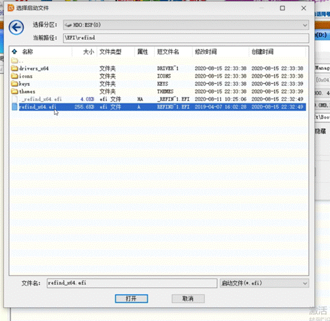

10.随便设置一个名字，并将其上移到顶端

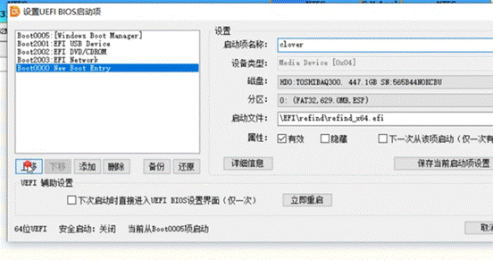

11.然后保存

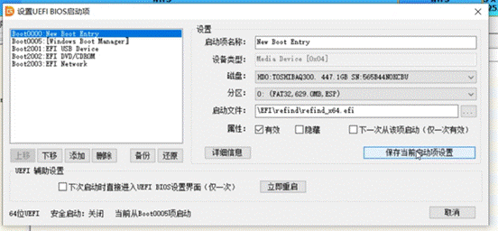
