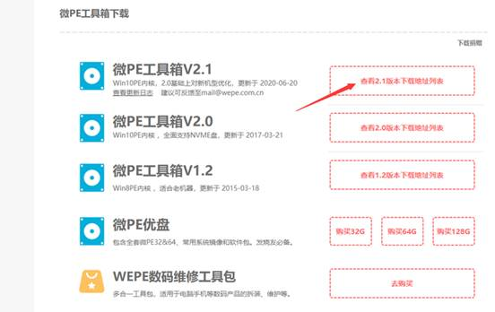

**制作****PE****启动盘**

首先进入微PE官网（[http://www.wepe.com.cn](https://link.zhihu.com/?target=http%3A//www.wepe.com.cn/)）下载微PE

   2.打开下载好的软件，软件默认名字是wepe_64.exe，如图所示，

   3.打开以后，我们选择安装PE到U盘

​    4.把之前准备的U盘插入电脑，制作PE需要格式化U盘，重要资料请先备份。检查U盘是否为刚才插入的U盘，如果没有识别到可点后面的刷新，U盘格式可选NTFS，老电脑比如2017年以前的配置，格式化选择FAT（此格式无法拷贝大于4G的文件），防止主板不识别U盘，其他参数默认不变

​      5.参数设置好以后，我们点击立即安装进U盘，开始制作，在37%的时候进度条会停顿不加载，这是正常现象。（友情提示：制作时请关闭火绒、360等软件）。稍等片刻就会制作完成，然后点击完成安装。

​      6.至此PE启动盘制作完成了，那我们如何进入PE呢？无论您是想装系统、拯救文件还是破解密码等，您要做的第一步就是从U盘启动进入PE系统。
