**重装系统**

1.选择“我没有产品密钥”

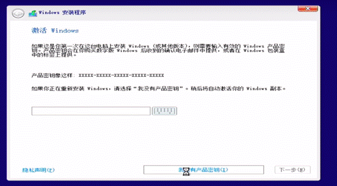

2.选择windows的版本

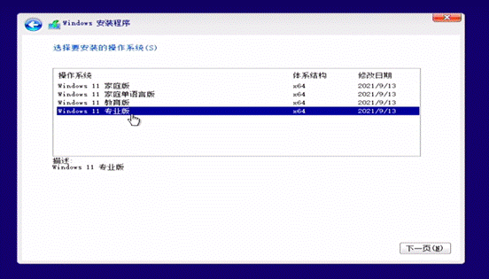

3.如果是安装windows 11系统，可能会出现下面的情况（原因可能是电脑没有开启或不支持TPM2。0,又或者是没有达到官方windows 11的硬件安装要求）

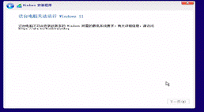

解决方法如下

 

**[****官方原版****win10_win11****系统安装教程** **【适用于新老电脑】【** **无视****TPM CPU****限制】重装系统教程****_****哔哩哔哩****_bilibili - 360****安全浏览器** **15.1 2023-10-22 19-53-46.mp4]**

4.然后选择自定义安装类型

 

 

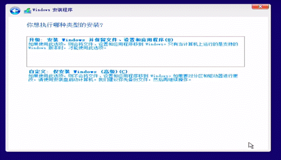

若是使用的全新的硬盘则会显示下图

 

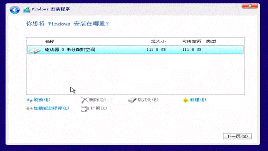

若是该硬盘以前存在系统，则会显示很多分区，只要把这些分区都删除就好了，然后再重建一个C盘来装系统

 

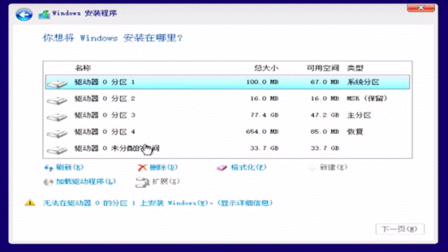

5.完成操作后就会出现下图的情况，分区1和2为系统保留分区，不用管它，然后3则为我们的主分区，也就是C盘，未分配的空间等我们进入系统之后再分配就好了，这里只用选择分区3然后在点击下一页，接着系统就安装成功了

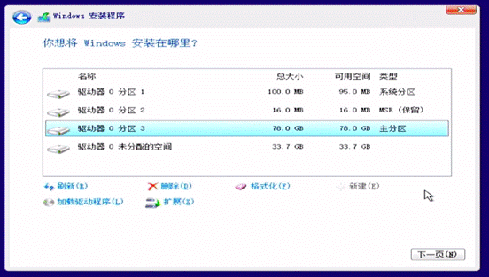

全新安装系统

  1.下载WIN10(最新版1909)的写入工具，下载完的文件叫Media Creation Tool+版本号.exe，打开运行：

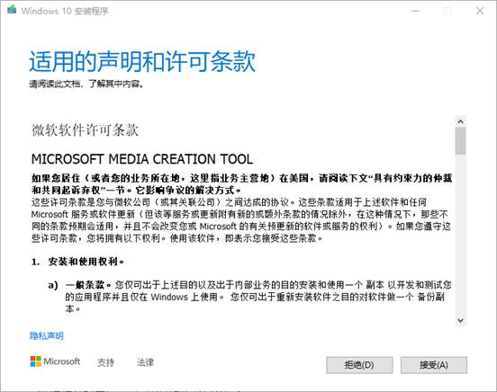

  2.选择写到U盘里面

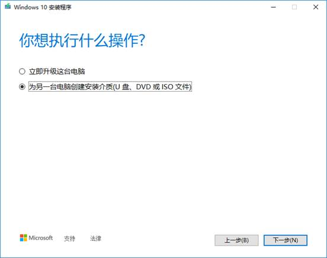

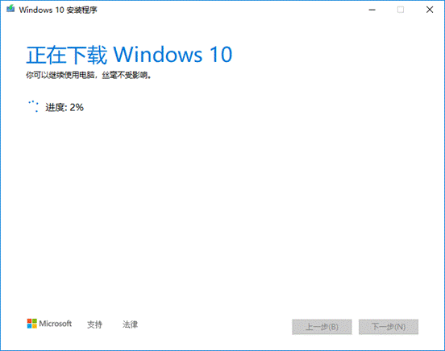

  4.重启电脑之后，会读取8G U盘进行启动，界面如下：

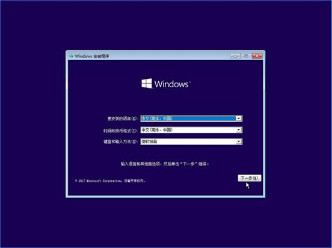

  5.因为没有密钥，可以选择下面小蓝字“我没有产品密钥”（等待系统装完之后，可以填写秘钥激活系统），直接下一步：

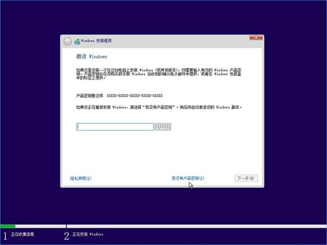

  6.操作系统选择，可以选择家庭版或者专业版（我都用专业版），然后进入安装选项，如果是老电脑会显示升级，我们直接选择自定义全新安装：

 7.由于我们电脑的硬盘全新的没有分区，点击“新建”，如果你硬盘比较大，建议给C盘做个100G的，当然30/50G也可以用

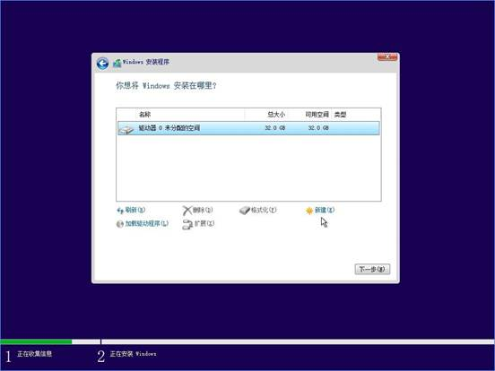

  8.选择我们目标分区（没有分完的等系统装完慢慢分），点击确定开始安装

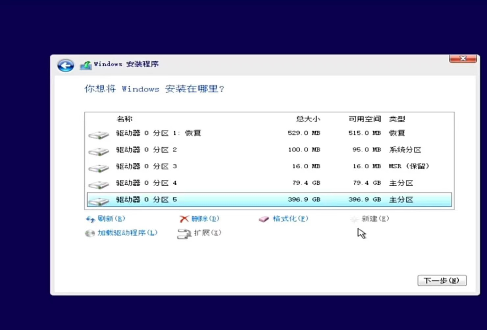

9.系统装完之后，拔掉U盘重启（后续也可以设置U盘为次启动盘）
