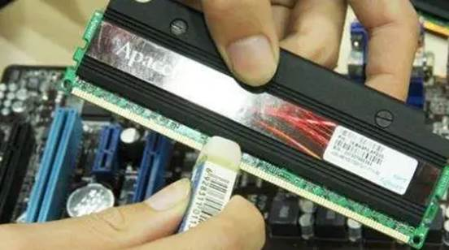
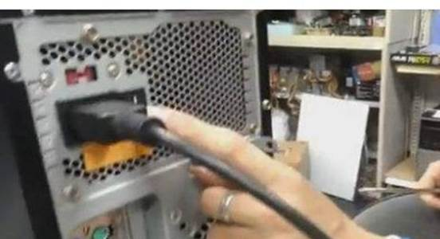

**完全黑屏**

3.2 **显卡、内存接触不良造成电脑开机黑屏****.**

这种问题出现得比较多.如果显示接触不良很容易出现黑屏,有些还会出现花屏等等故障,这时可打开机箱,然后用十字镙丝刀取下显卡,最好用橡皮擦擦试一下那个“金手指”部分,再重新插入试试;也有可能是内存松动,解决方法同样,擦试后重新插入.也可以更换一根内存插槽测试.

3.3 **显示器损坏或接触不良造成电脑开机黑屏****.**

如果显示器与电脑的连接松动也同样会出现电脑开机黑屏现象,所以检查一下连线是否接牢,还有一种情况就是显示器损坏,其实你的电脑是正常工作的,只是你无法显示,这时你可以按一下电脑键盘的【NumLock】或者【CapsLock】键,看看那个灯会不会有反应,如果有反应,基本可以确定电脑主板是正常的,说明显示器损坏或接触不良.

3.4 **电源有问题造成电脑开机黑屏****.**

 

大多出现电脑黑屏不显示是因为电脑电源有问题,可以看一下电源后面的风扇有没有转,如果没转,检测有没有电输出过来(检查电源插板等等),确定有电输入,那么基本可以判断电源有问题,有些是转一下马上停,也有些是正常转的,能转不一定就是好的,有条件可以用另一台电脑电源替换测试一下.

3.5 **CPU****损坏造成电脑开机黑屏不显示****.**

如果CPU出现问题那么电脑一定是无法显示的,CPU出现问题概率比较低,最可能的原因是CPU风扇坏了导致CPU温度过高而烧掉,首先打开机箱,检测一下CPU风扇有没有转,如果没转就有点麻烦了,估计CPU烧坏了,只能更换CPU;如果风扇是转的可以用手摸摸CPU(注意在摸CPU之前请在金属类的物品上先摸一下放掉手上的静电),如果是凉的说明CPU没有工作,也可以说明CPU有问题.