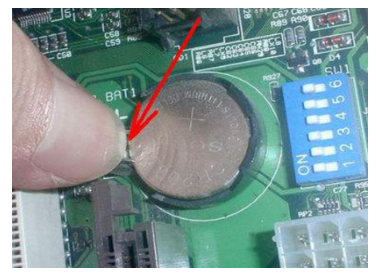

## 电源灯闪一下又灭不能启动

1、当主机处于待机状态时，电源指示灯也会是一闪一闪的，这时，一般通过按键盘或者动鼠标来唤醒电脑，如果按键盘和动鼠标无法唤醒主机，需要按一下电源开关键，这时即可唤醒主机，通过此次操作依然无法唤醒主机时，尝试第二个步骤。

2、可能是由于系统无响应，假死现象造成的，此时，你需要按下电源开关按钮长达十秒，使主机彻底关机后，再尝试重新开机，在查看故障是否解决。

3、故障问题依旧存在，可能是由于电源电压不稳定导致的，观察其他电器是否可以正常工作。排除掉电压原因。

4、内存松动引起的主机无法开机，切断主机电源，尝试将主机内存条拔下来，用橡皮擦拭金手指，复装之后，开机，观察故障是否解决。

5、主板静电引起的无法开机，此时，可以尝试将主板主板cmos电池抠除，用金属物件短cmos电池引脚，放电之后，复装电源，开机尝试故障是否解决。

6、如果操作完上述步骤仍然无法解决问题，建议交由专业人员处理。
