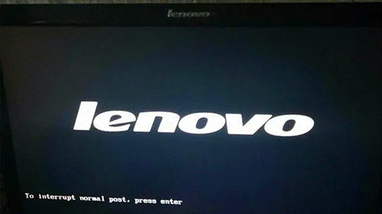
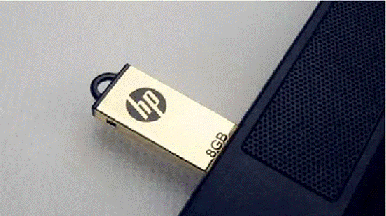
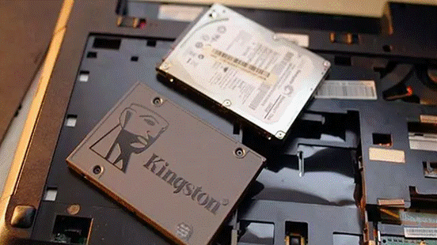
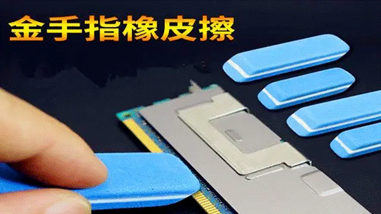
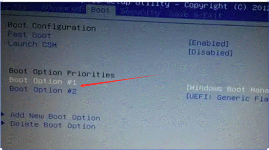
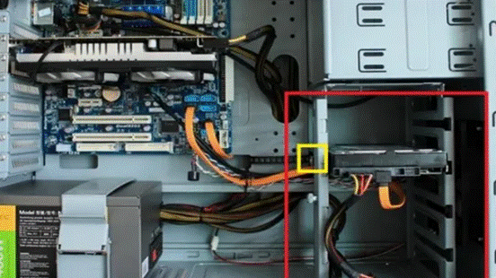
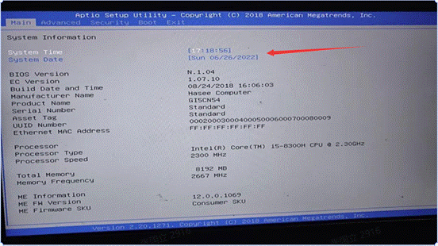
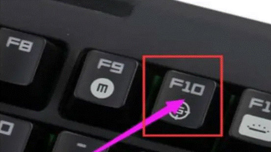

**能显示****logo****进不去系统**

**一****.****外部连接的设备接触不良导致的开机故障问题****.**

尝试把所有外部USB设备拔取下来,然后逐个检查外部设备(包括键盘、鼠标、U盘、音响、摄像头、耳机等等).

**二****.****硬盘的接触不良导致的开机故障问题。**

尝试拆开机箱盖(笔记本后盖),把硬盘线都拔掉,再重新启动电脑,如果能通过logo画面,说明是硬盘或者硬盘数据线所导致的问题,更换一条硬盘数据线测试即可.
**检测方法：用PE系统启动，利用PE系统中的Disk Genius进行硬盘检测**

**三****.****内存条的接触不良引起的开机故障问题****.**

这种情况,一般是出现在有多根内存条的电脑上,需要拆开机箱盖(笔记本后盖),然后插拔所有内存,并逐个把单根内存插好,交替尝试进行开机检测.如果说有那一根内存条检测不通过,用橡皮胶把内存条金手指擦拭干净,或者更换为一根全新的内存条即可.

**四****.****主板****BIOS****数据出错导致****.**

尝试进入主板BIOS,如果可以进入到主板BIOS,我们直接初始化BIOS设置信息,再按F10保存退出重启电脑;在进不了主板BIOS设置的情况下,我们可以将主板的纽扣电池取下来,再放回原位,也可以将BIOS设置恢复默认设置,完成初始化BIOS设置信息.

开机进BIOS

**一****.****没有合适的启动项****.**

看主板BIOS界面的Boot菜单页面是否能找到硬盘,如果能找到说明bios第一启动项设置错误,直接把first 或者#1里面设置成你的硬盘,F10保存重启,即可;如果找不到说明硬盘没有读取到,需要关机,拆开机箱盖(笔记本后盖),检查硬盘连接线,排查硬盘线是否正常.

(注:如果上述办法没能解决问题,很大可能是硬盘出现损坏，需要更换硬盘调试.)

**二****.****主板电池没电失效导致****.**

可在BIOS界面查看系统时间是否准确,如果不准确,则可判断是主板电池失效,导致电脑调用BIOS默认参数,如果与本机硬件环境不符,则无法正常启动电脑.可购置主板电池进行替换(或拆下BIOS电池等待一分钟再装回去开机),再开机进入BIOS界面,并重新设置正确的参数,最后按F10保存退出重启.

**三****.****系统文件被修改导致****.**

开机进入BIOS界面,然后按 F9 键恢复BIOS默认设置,按F10 保存退出,再重启电脑确认是否可正常进系统.

键盘轴损坏导致

有可能键位损坏导致某按键自动触发进入BIOS,更换键盘再进行检测即可.
