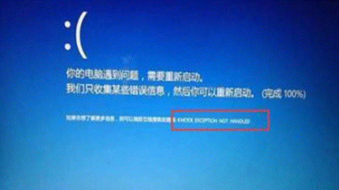
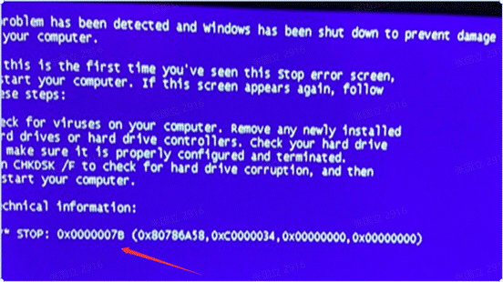
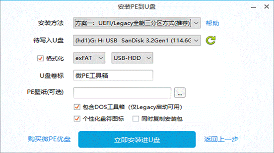
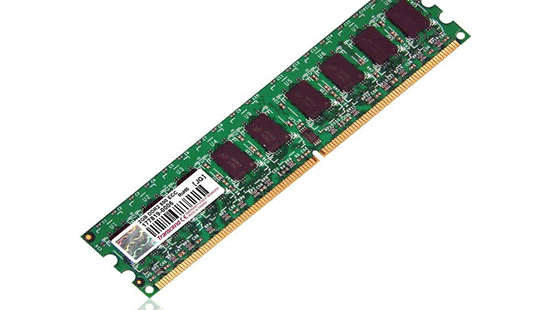
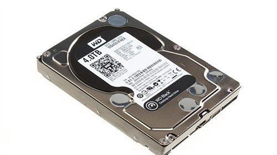
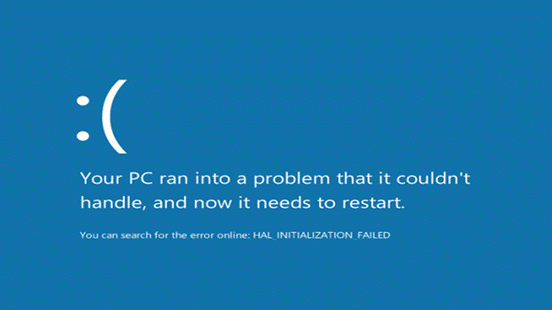
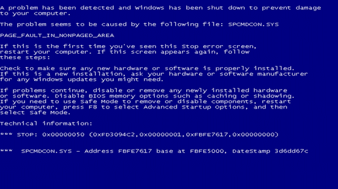
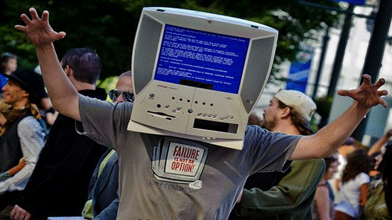

## 进系统蓝屏

**一****.****驱动程序导致蓝屏****.**

有可能是驱动程序不兼容,安装未知程序会导致蓝屏.先根据蓝屏代码来搜索下,此代码具体是因为什么引起的;然后重启电脑按F8,选择进入安全模式把出现错误的驱动给卸载掉;再根据找出驱动出现问题的设备,重新安装驱动.(驱动没必要追求最新)(或者使用Windows系统还原功能，直接将系统恢复至上一个还原点进行检测)

**二****.BIOS****硬盘兼容出错导致蓝屏****.**

在这种情况下,常见的[蓝屏代码](https://www.zhihu.com/search?q=蓝屏代码&search_source=Entity&hybrid_search_source=Entity&hybrid_search_extra={"sourceType"%3A"answer"%2C"sourceId"%3A1833160713})为0x0000007B和0x000000A5.要重新启动计算机,快速并间歇地按热键进入BIOS,找到SATA Configuration(SATA配置),如果要安装XP,则更改为IDE,如果没有IDE模式,则更换其他系统.

**三****.****系统文件丢失或损坏****.**

这种情况需要重装系统了,推荐pe重装比较便捷.

**四****.****硬件问题引起****.**

有时候是内存条接触不良导致,需要清理机箱内灰尘,拔下内存条,用橡皮擦拭金手指,再重新插紧.或者换一条新的内存条.

有可能是硬盘出现了故障,首先检测硬盘坏道情况,如果硬盘出现大量坏道,建议备份数据更换硬盘.如果出现坏道比较少,建议备份数据,重新格式化分区磁盘.(HD Tune这款软件可用于检测硬盘的健康状况)

还有病毒木马导致的电脑蓝屏的情况,推荐使用Process Explorer强制终止恶意进程(微软官方推荐的进程监视工具).

有可能是因为电脑温度过高导致蓝屏,如果出现电脑蓝屏而电脑内部温度很高,那么很可能就是散热不良导致电脑蓝屏,可以拆机检查是电脑的哪一部分造成.如果是 cpu 或显卡温度过高,那么就要考虑更换CPU风扇或显卡风扇;如果是硬盘温度过高,那么就有可能是硬盘出现故障.

还有其它很多原因比如电脑电源出现故障,导致供电不正常,还有的是电脑硬件不兼容,这种情况多数出现在组装电脑上,建议购买组装电脑去选择搭配均衡,兼容性好的硬件搭配.
