在锁屏界面进不去系统

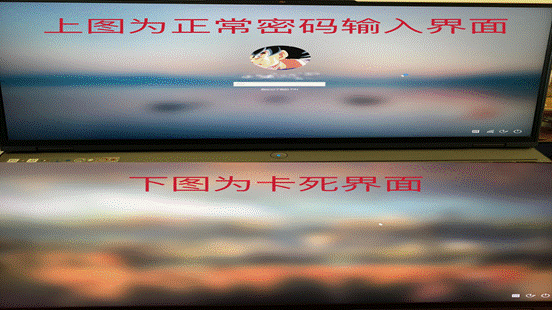

**一****.****电脑卡住导致****.**

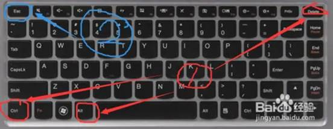

同时按下ctrl、alt、delete三键,然后按esc退出当前页面.

**二****.****电脑组策略出现问题****.**

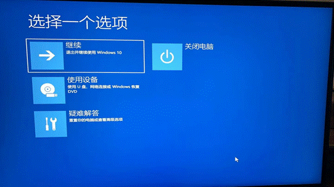

尝试以安全模式启动,在选项界面依次点击“疑难解答”“高级选项”“启动设置”“重启”,开机后键盘上按F4,即可进入安全模式.在安全模式可以进入后,重复第一步,重新来到选项界面.选择“继续,退出并继续使用windows10(以win10为例)”.之后电脑可以正常弹出密码登录界面并进入系统.(此时虽然电脑可以正常使用，下一次正常开机或者重启后，还是会卡死在开机屏保，无法弹出密码登录界面)

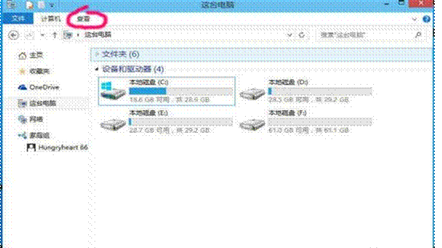

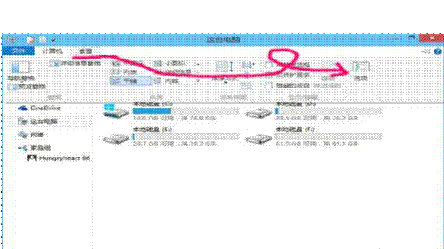

进入系统重置组策略,首先必须清理组策略设置文件,这些文件是隐藏的,需要先显示隐藏文件,在资源管理器Q中点击“查看”菜单,选择“选项”.

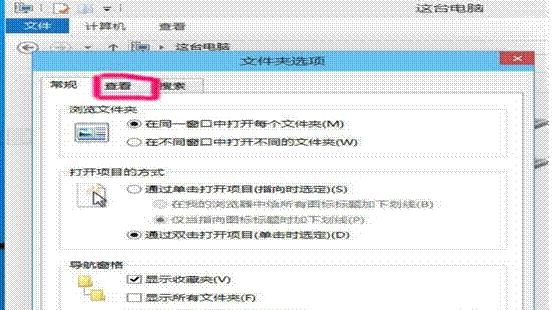

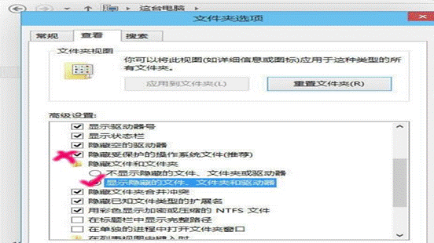

将隐藏的文件显示.

打开C:Windows\System32\GroupPolicy,把里面的所有内容全部删除.

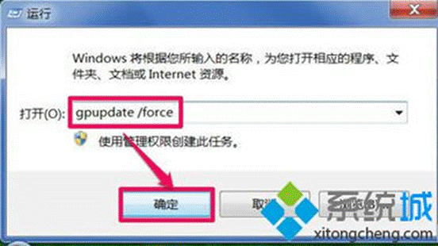

按Win+R打开运行,输入gpupdate /force,点击确定,就会刷新组策略.(注意要先显示隐藏文件，才能看到GroupPolicy文件夹)

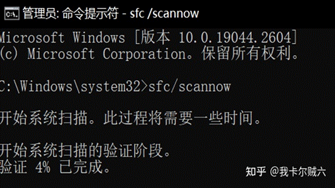

电脑左下角搜索框搜索“命令提示符”,右键选择“以管理员身份运行”,在命令提示框输入 sfc/scannow 扫描结束后,出现提示“Windows 资源保护找到了损坏文件,但其中有一些文件无法修复”.

此时我们需要用到Dism指令进行修复.还是在命令提示框中输入上述指令,如果,上述命令输入完成后,出现如下图片所示情况,继续输入第二个命令,再输入第三个指令.

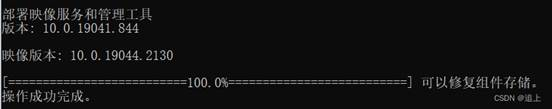

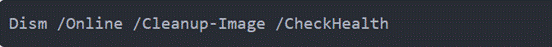

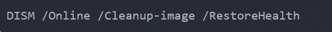

如果没出现上图操作成功情况,需要按下win+R打开运行,输入:services.msc

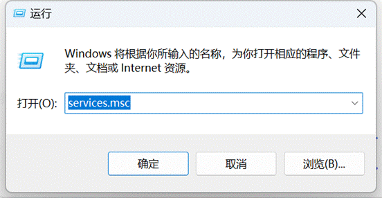

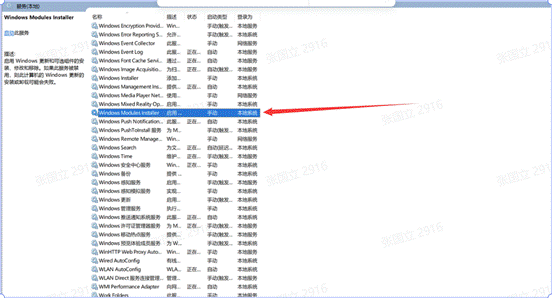

找到Windows Modules Installer,右击它,点击启动.启动服务后重新尝试是否可以正常运行sfcX /scannow命令,若不行则再次打开运行(win+R),输入: regedit 点击确定打开注册表;

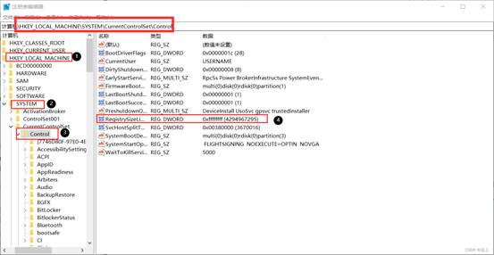

展开HKEY_ LOCAL_ MACHINE\System\CurrentControlSet\Control,在Control右侧找到RegistrySizeLimit.如果没有的话,在右侧空白区右键点击新建一DWORD(32位-值), 命名为RegistrySizeLimit;双击打开"RegistrySizeLimit",点击“十六进制”,然后在左侧输入: ffffff (8个f就对了不要多也不要少),点击确定保存设置.设置完成后重启电脑,在命令提示框输入 sfc/scannow 查看问题是否解决.