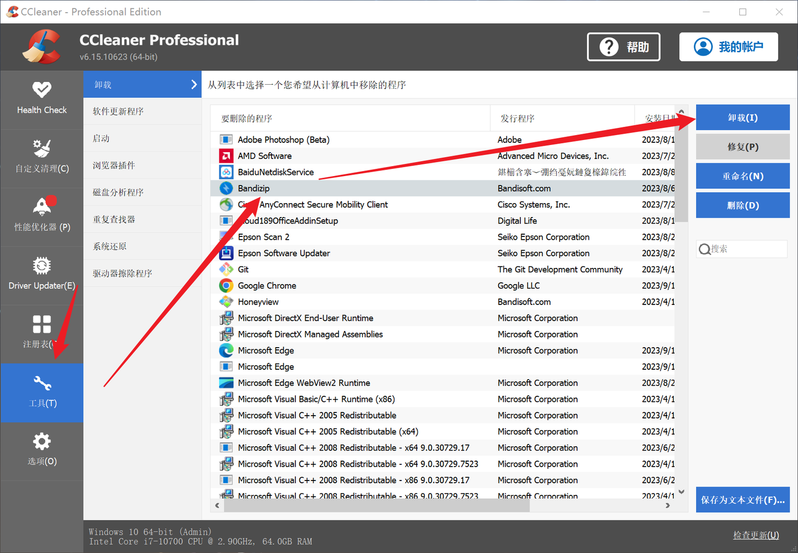
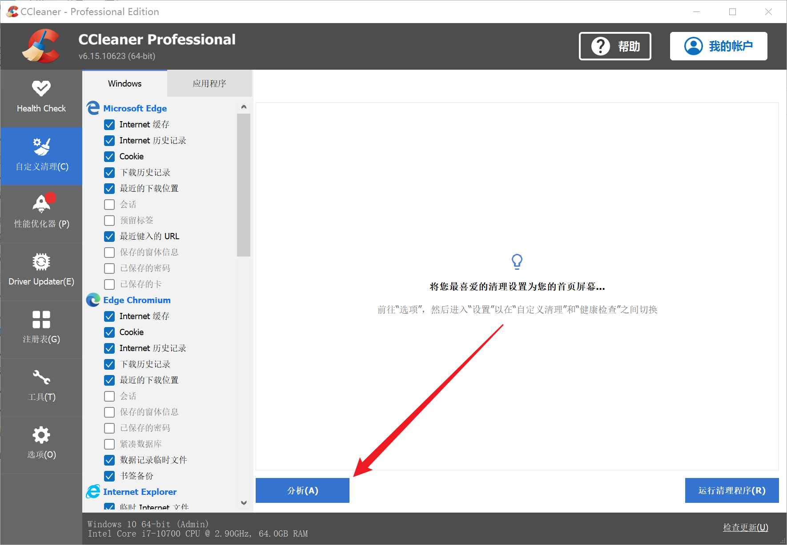
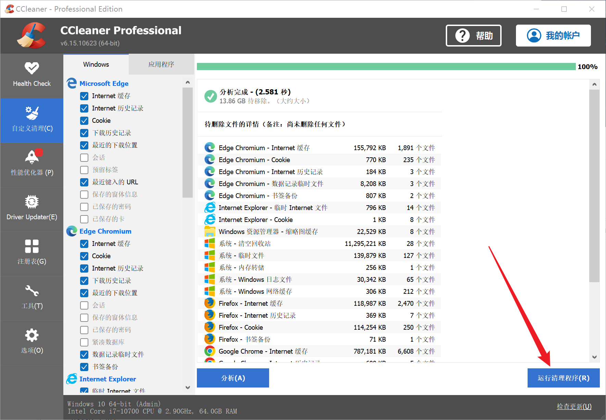
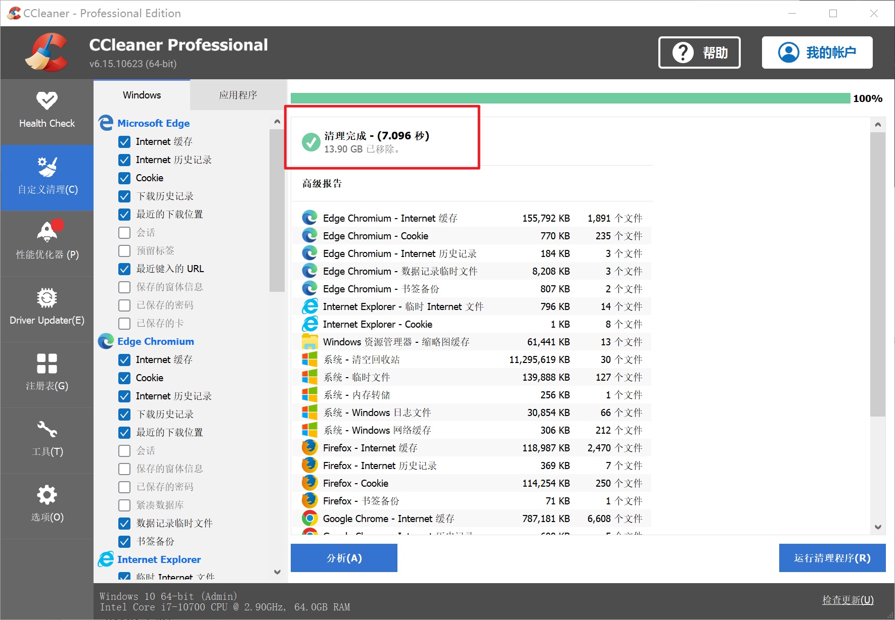
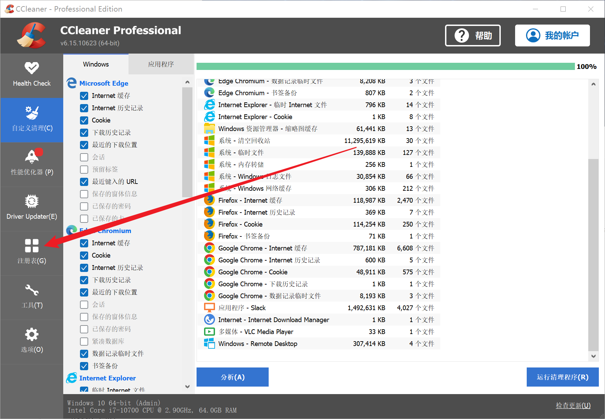
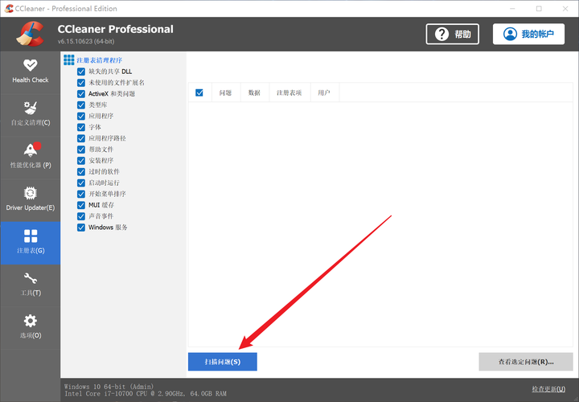
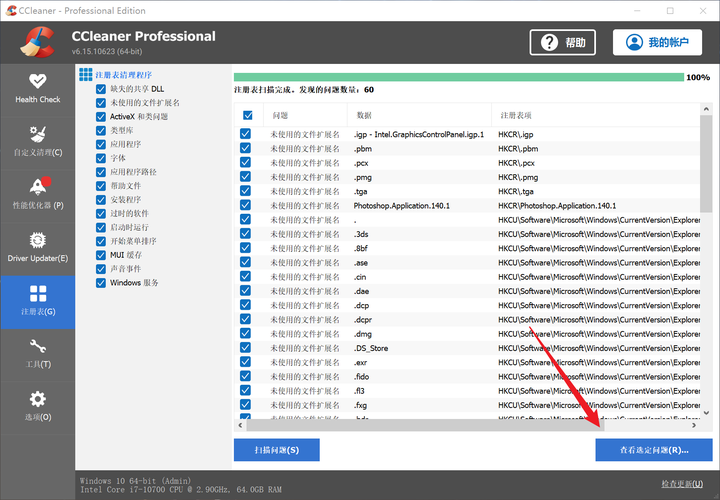
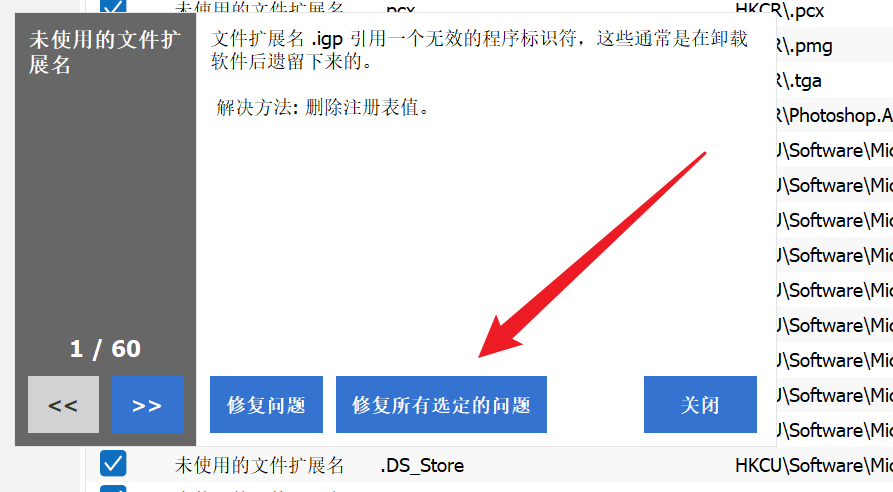

1. ###   C盘n空间不足

   ​      利用CCleaner清理磁盘垃圾（以下图片来自https://www.zhihu.com/question/553761875）

   ​    1.删去流氓软件以及无用软件：

   ​    先打开软件，点击左侧的“工具”，然后选中要卸载的软件，这时候会发现右侧的卸载按钮从灰色变成了蓝色，这时候我们点击“卸载”，就可以卸载选中的软件了

   

   ​    2.删去垃圾文件：

   ​    （1）.打开软件之后，先点击自定义清理，然后点击分析，寻找垃圾文件

   

   ​    （2）.分析完成之后，页面上会显示待删除的文件信息，以及可以移除的垃圾大小。这时候我们点击运行清理程序，如果有弹框提示，就点击继续

   

   ​    （3）.清理完成之后就会显示出“清理完成”的提示以及移除了多大的内存

   

   ​    3.如果还想让电脑更干净那就清理注册表：

   ​    （1）.打开CCleaner，里面有个注册表，我们点击它

   

   ​    （2）.在注册表清理程序中，默认是选择了所有的选项，这时候我们点击“扫描问题”，然后上面会有个绿色的进度条移动，我们等进度条加载完就好

   

   ​    （3）.当扫描完成之后（也就是进度条加载完之后），右下角的“查看选定问题”会变成蓝色，然后我们点击它

   

   ​    （4）.这时候会弹出一个是否备份注册表的提示，我们点击“否”，然后点击“修复所有选定的问题”

   

   

   ​    5）.问题修复完成之后，点击“关闭”即可，至此，注册表就清理完毕啦

   