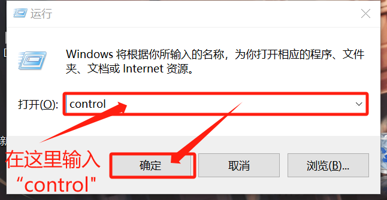
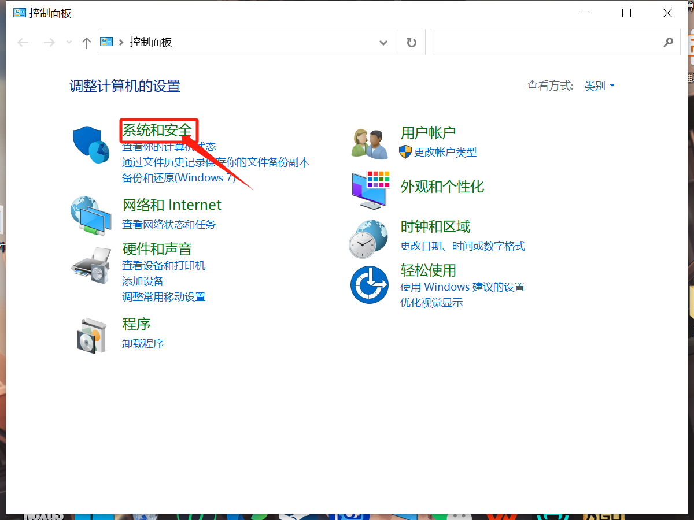
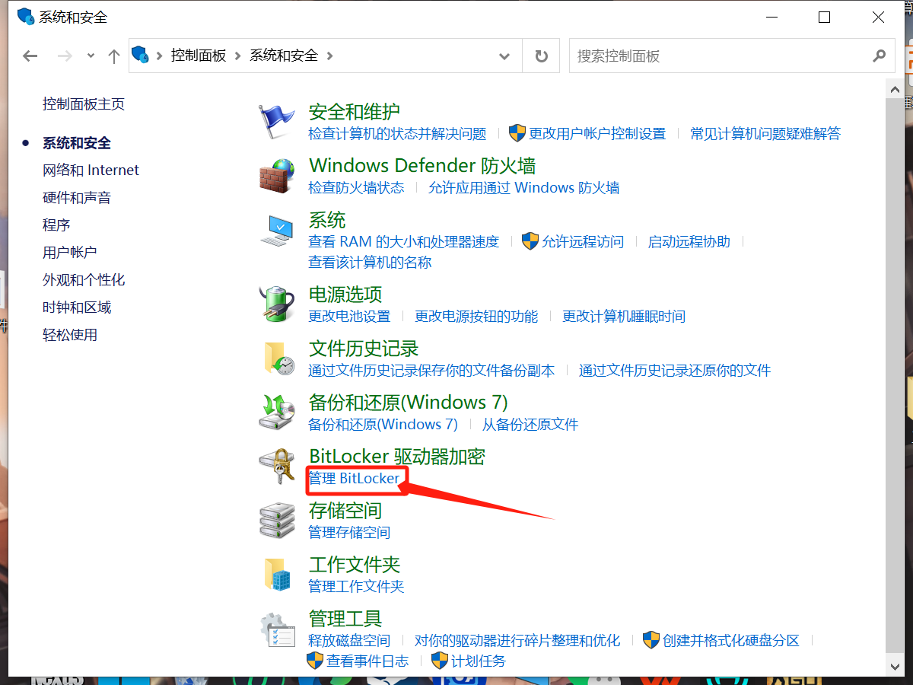
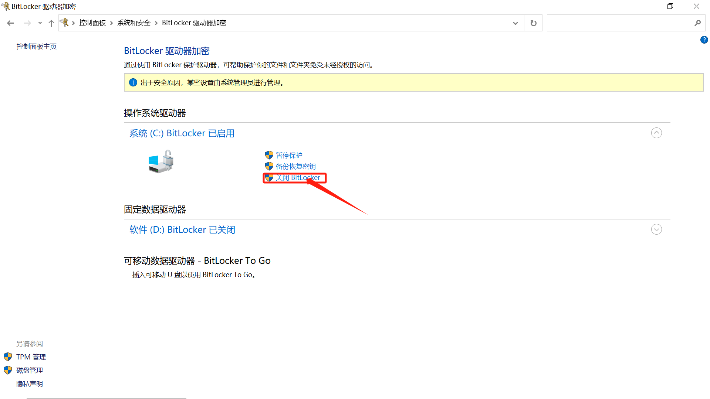
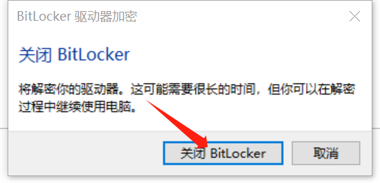
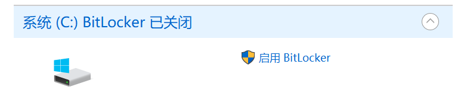
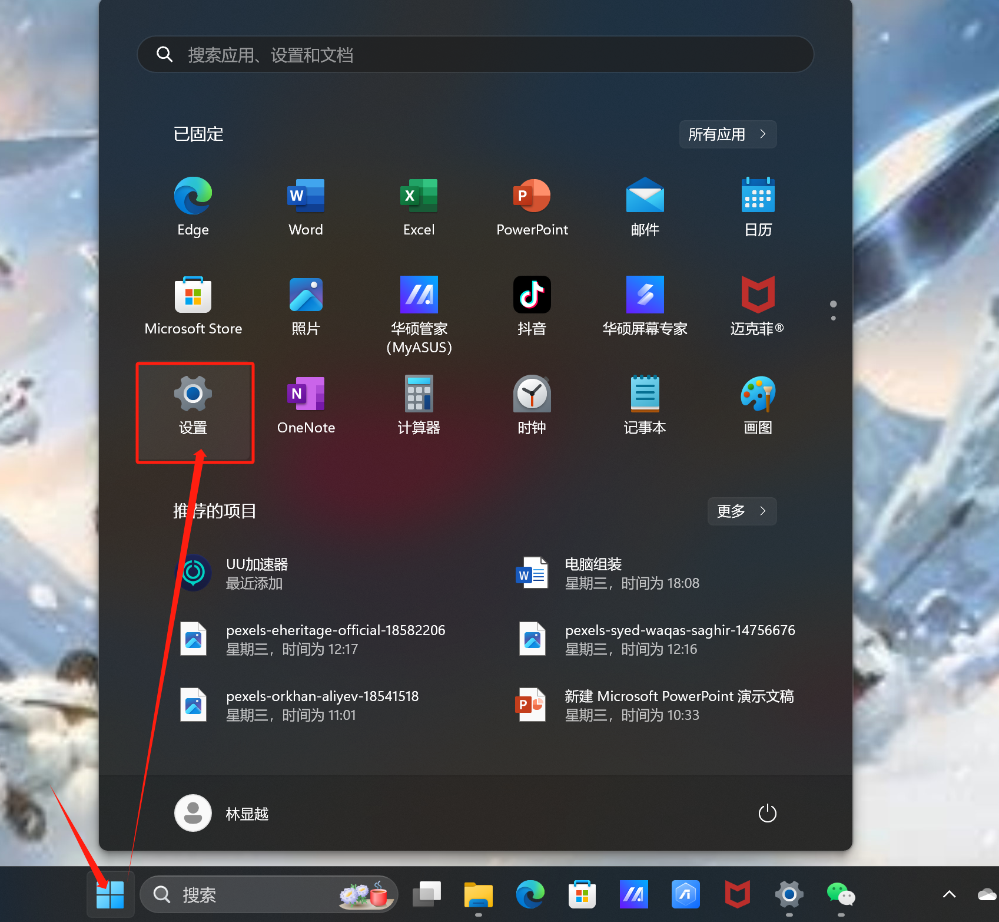
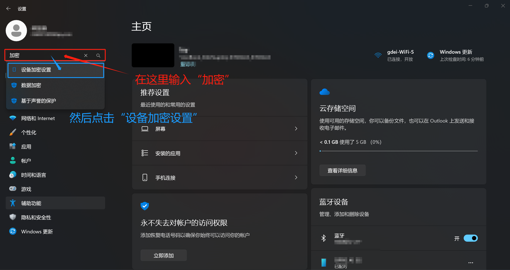
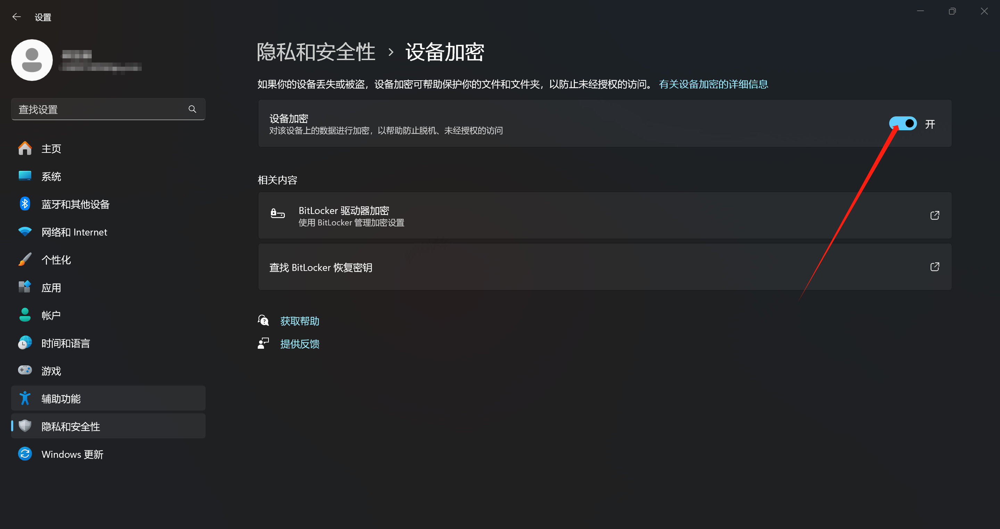

1. ###   关闭BitLocker

         1.win7,win10系统：

         （1）[下面以win10为例]  

         先按“win＋r”打开运行，然后在里面输入“control"，输完点“确定”

   

      （2）.然后就会打开控制面板,然后点击“系统和安全”

   

      （3）进去后点击“管理Bitlocker”

   

      （4）.然后点击“关闭Bitlocker”

   

      （5）.会跳出来这样一个弹窗，我们点击“关闭Bitlocker”，然后等待几分钟（具体时间根据电脑不同而不同，期间是可以正常使用电脑的）

   

      （6）.最后显示这样就表示你已经关闭Bitlocker啦

   

      2.win11系统：

      (1）.首先点击任务栏中的win图标，然后点击“设置”

   

      （2）.然后在搜索栏那边输入“加密”，再点击下面的“设备加密设置”（也可以直接输入“设备加密设置”）

   

      （3）.然后将开关关闭

   

      （4）.然后会跳出这个页面，点击“关闭”即可（期间电脑可以正常使用）

   