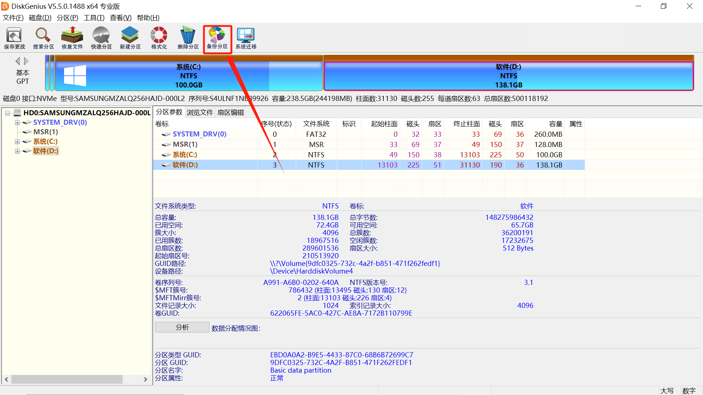
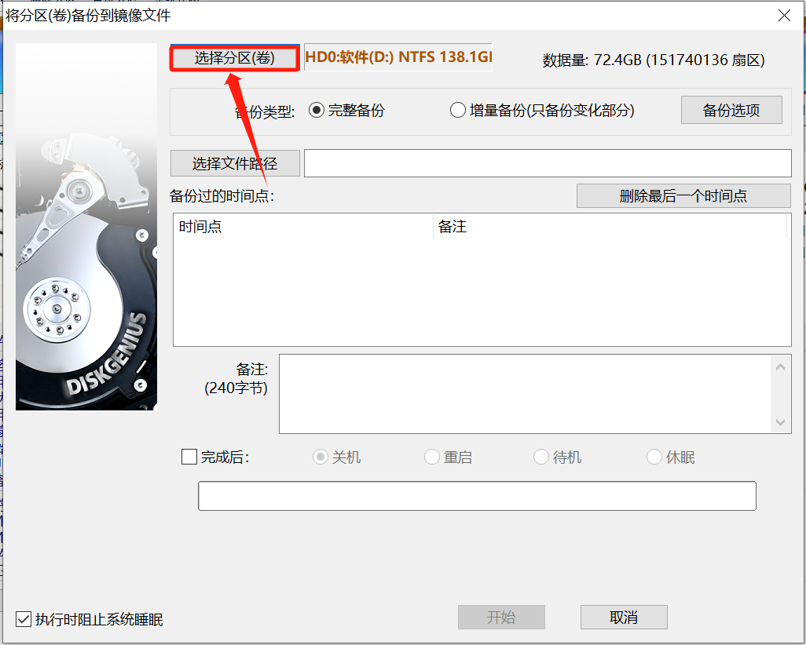
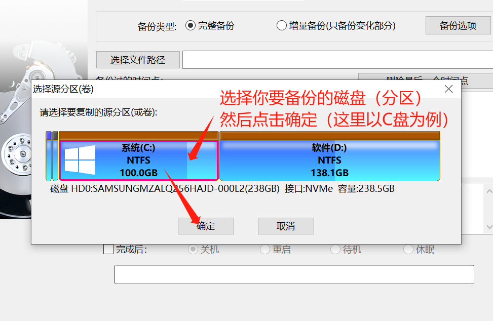
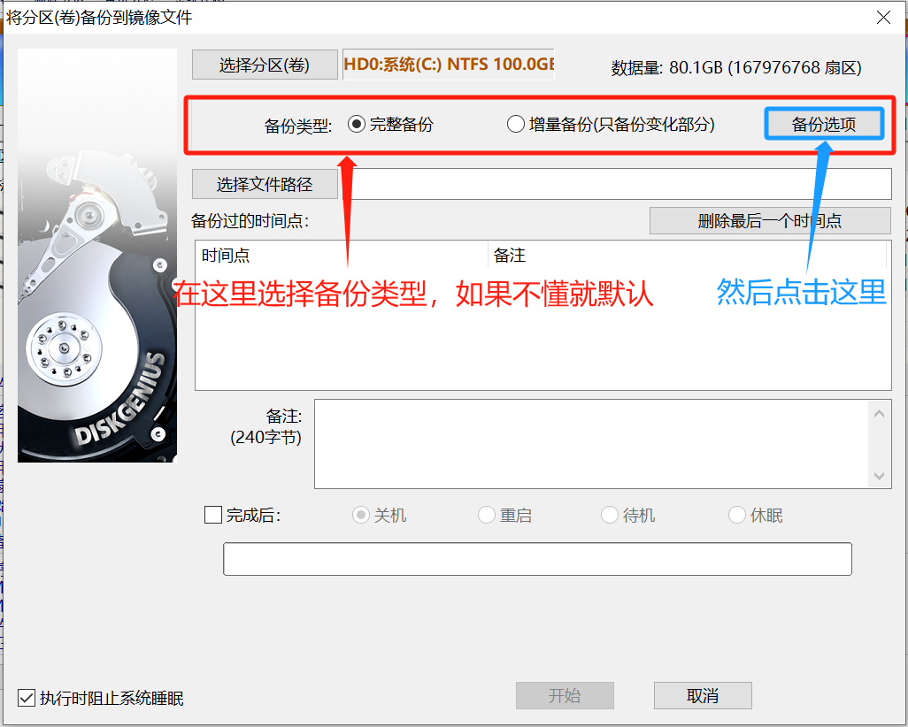
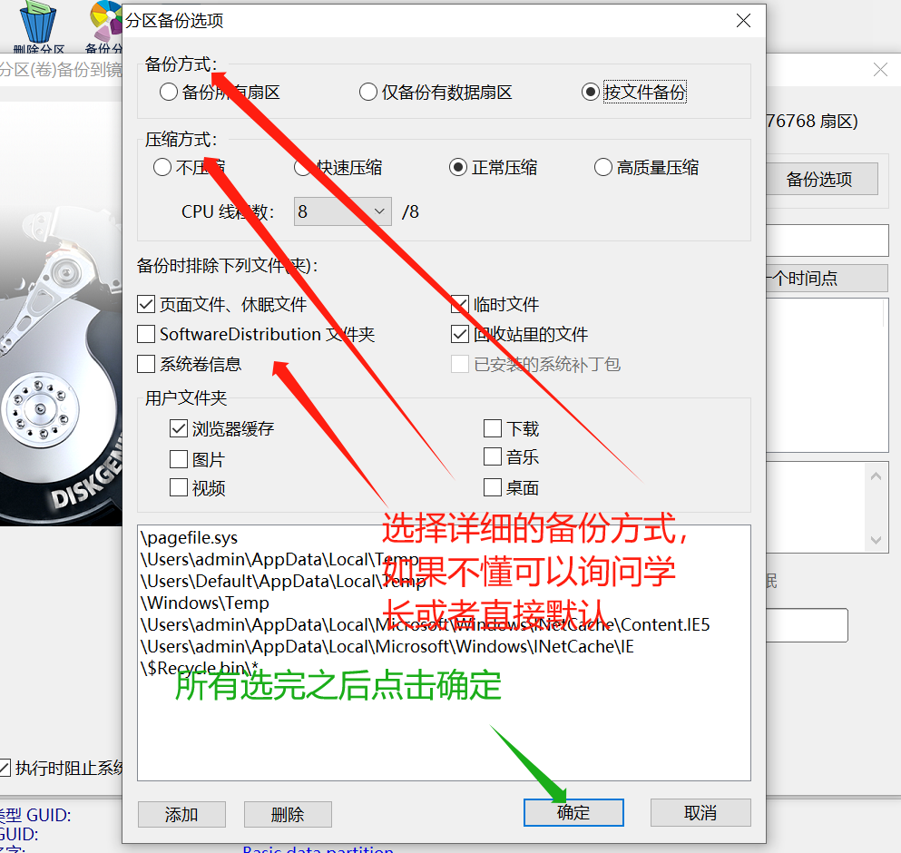
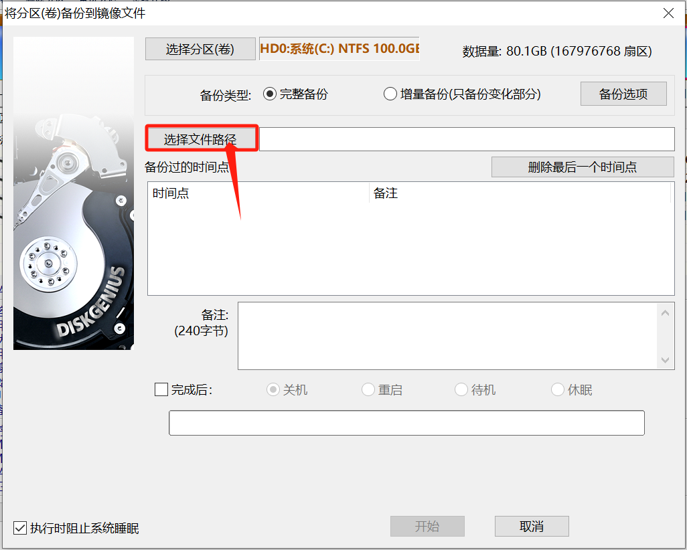
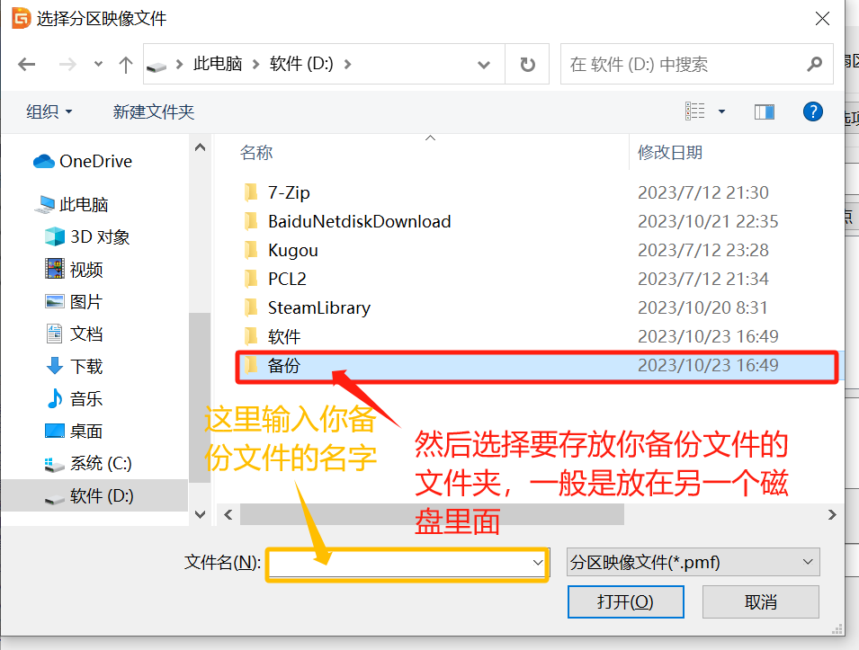
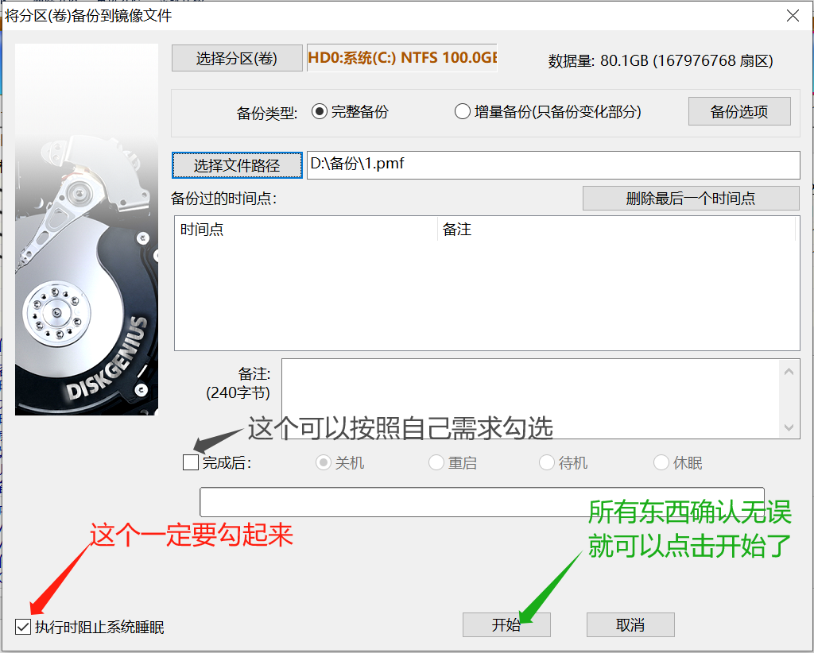
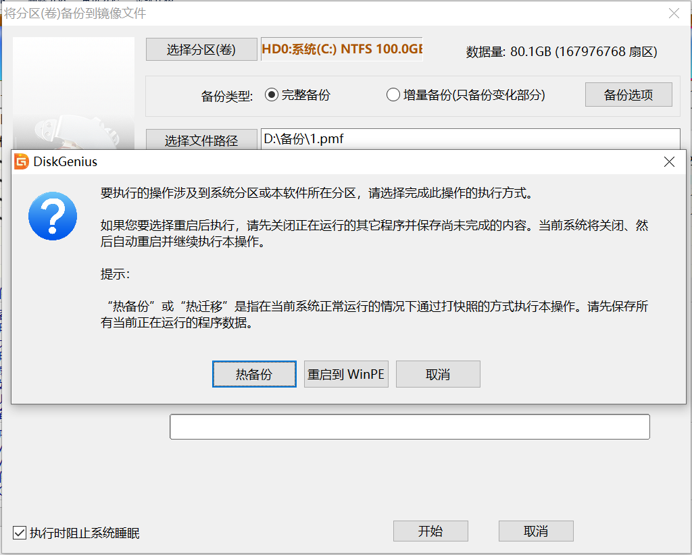
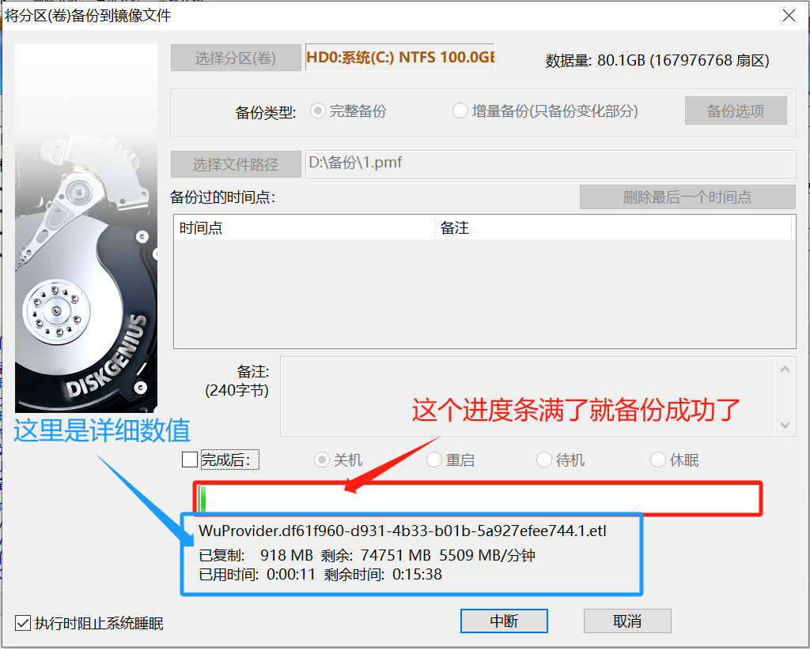

  分区备份

   利用DG来进行操作：

   打开软件，点击“备份分区”

   2.然后会跳出下面的页面，点击“选择分区”

   3.在这里选择你要备份的分区，然后再点确定

   4.然后会回到之前的页面，接下来就选择备份类型，然后点击“备份选项”

   5.然后在这里选择高级的备份方式，在“备份方式”那一栏的三个选项中，把鼠标放在其中一个选项的字上面会出现对应选项的说明（这里就不演示了），所有选择完毕之后，点击右下角“确定”

   6.确定之后会自动回到之前的页面，然后点击“选择文件路径”，这里是选择你备份的文件放到哪里的意思

   7.然后选择你要保存你备份文件的地方，我们一般是选择另一个磁盘里面弄个文件夹放，当然你想放哪里都可以，双击点进去之后，在下面输入你备份文件的名字（一定要输，要不然不能进行下一步），然后点击右下角的“打开”

   8.弄完之后就变成下面那样，备注那个地方根据个人需求可以写也可以不写，一般都不写，然后就根据图片的走，全部弄完就可以点击“开始”啦

   9.由于此次备份操作涉及到系统分区，软件会显示下面的信息。点击“热备份”按钮，软件会立刻对系统分区进行备份（尽量把正在运行的软件都关了）；如果选择“重启到WinPE”（没有PE盘就直接点击热备份），当前系统将自动重启到WinPE环境并继续执行备份操作。

   10.开始之后就出现下面的情况，现在就等进度条拉满就备份完成啦（个人建议有空就备份一下自己重要的数据哦，毕竟数据如果因为什么意外丢失了那大概率是完全没了，那个时候再后悔就晚啦）

