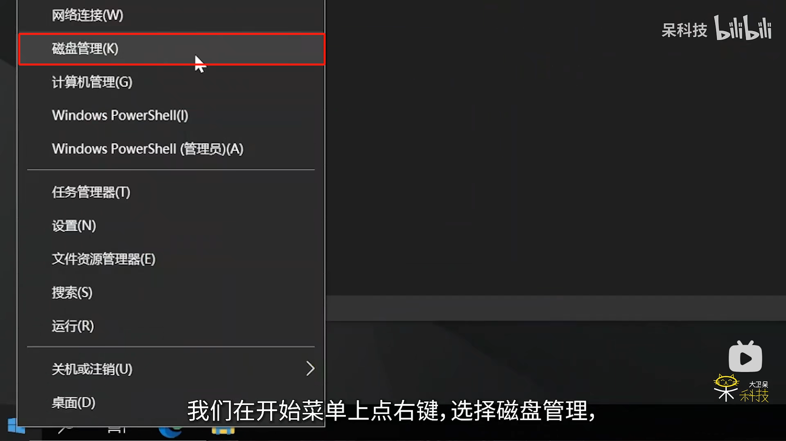
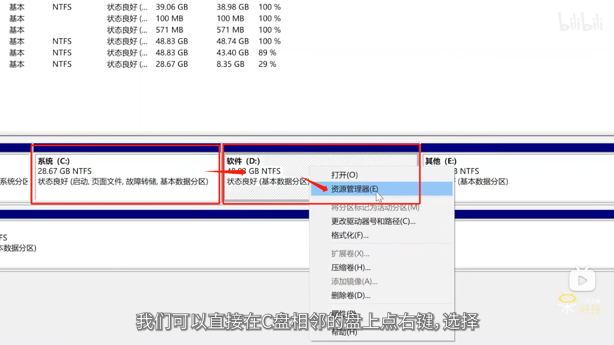
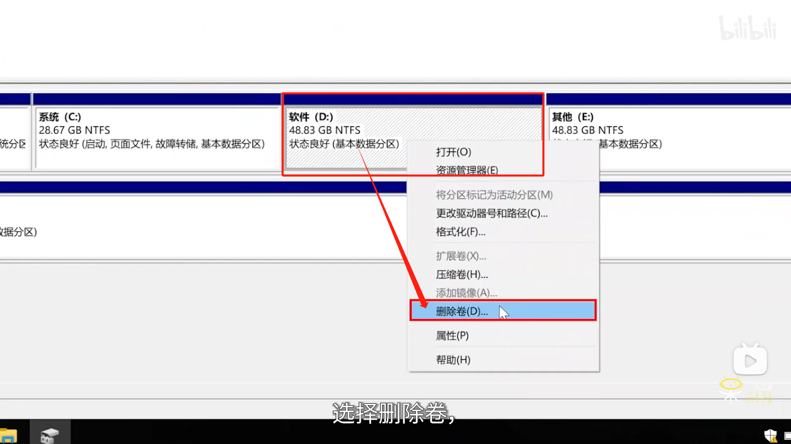
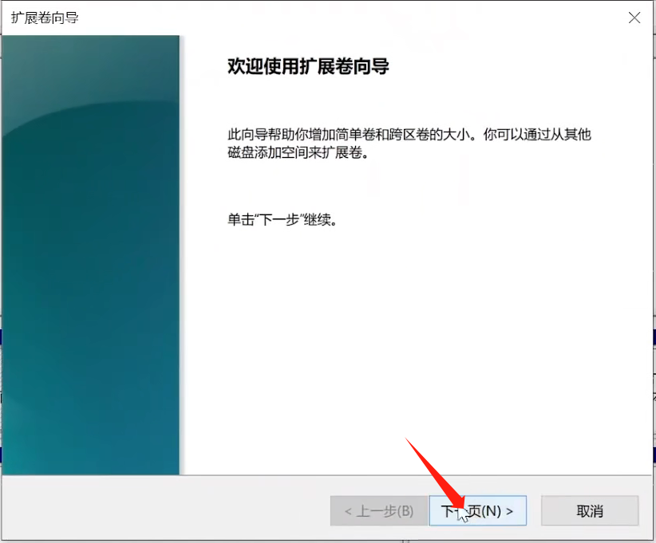
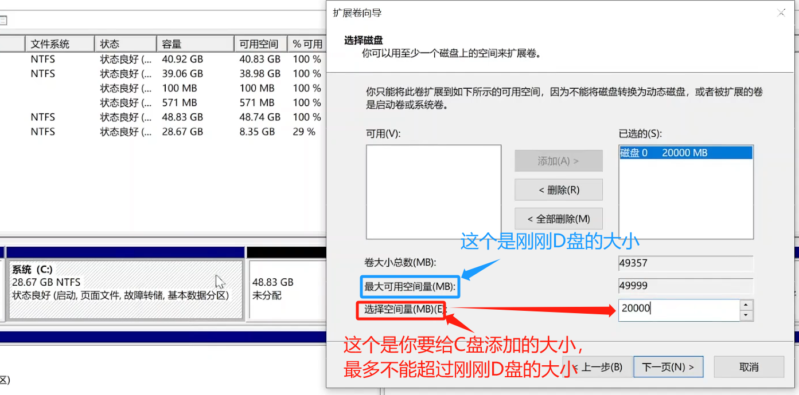
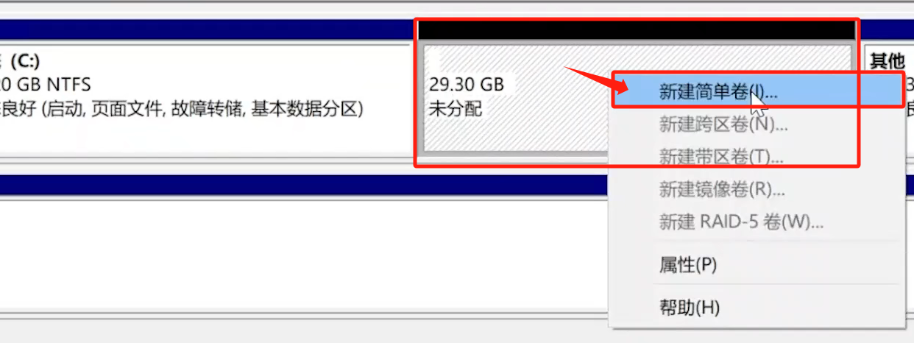

  ## 扩盘（

以下图片来自B站大卫呆科技教室）

   1.在开始菜单上点击右键，然后再点击磁盘管理（下面图片例子是win10系统，win11也是一样的操作）

   2.然后就能打开windows自带的磁盘管理页面

   3.找到与C盘相邻的另一个盘（一般是D盘，下面统称D盘）右键它再点击资源管理器

   注意：一定是与C盘相邻的另一个盘

   4.然后就会打开这个盘的文件管理，此时我们需要将在D盘的所有有用的文件全部移动或者拷贝到除了C盘和D盘之外的其他磁盘上（如果没有其他磁盘就利用U盘或者移动硬盘等）

   （没有用的文件可以不用移动或者拷贝，因为等会留在D盘中的所有文件会被删除）

   5.准备工作做完之后，我们再次回到磁盘管理，右键D盘，点击删除卷

   6.然后会跳出下面这样的一个提示，如果确认D盘中没有重要的文件之后就点击“是”

   7.然后D盘就变成下面的样子，并且此时D盘中的所有文件已经被删除

   8.然后我们右键点击C盘，再点击扩展卷

   9.之后会弹出扩展卷向导，我们点击“下一步”

   10.然后就可以开始为你的C盘添加容量啦，看图片可能会有人问为什么上面写的是49999MB，然后未分配那里写的是48.83GB，这是因为单位不同，里面涉及到了单位换算问题，我们不需要去管他

   11.如果你是把刚才D盘的所有内存都加进了C盘，那么接下来的情况你就可以不用看啦（因为你已经完成了将C、D两个盘合在一起了，也就是将C盘扩充了D盘的大小）。如果你只是扩了一部分，那么会出现下面的情况

   12.然后你可以选择不管（就可以打机了，就是会有一部分内存一直用不了而已），也可以选择将这一部分未分配的重新做成D盘，具体操作如下：

   （1）.右键点击未分配，然后点击新建简单卷

   （2）.一样的也是会出现向导，然后无脑点击下一步就可以啦，点完之后D盘就回来啦，然后扩盘就完成啦

