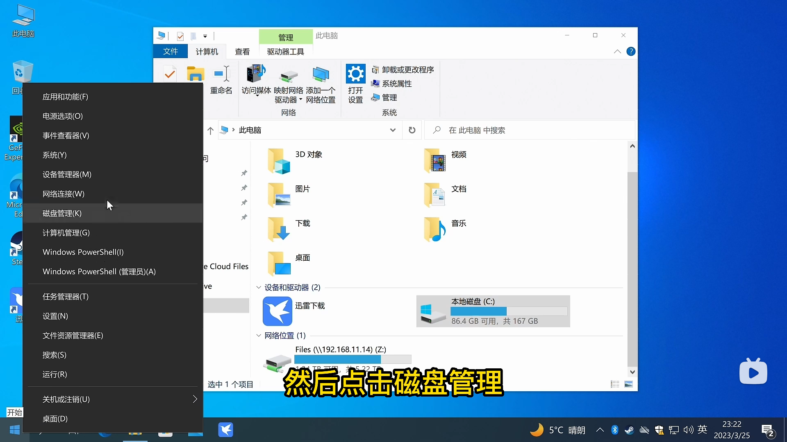
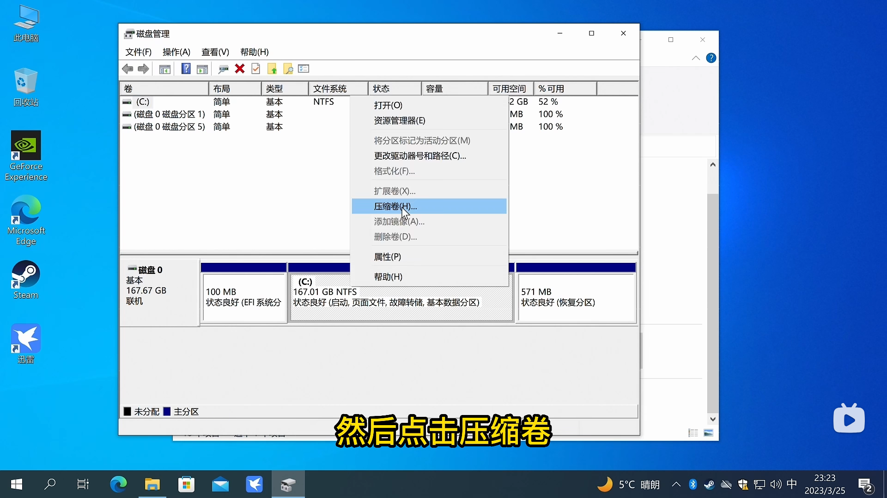
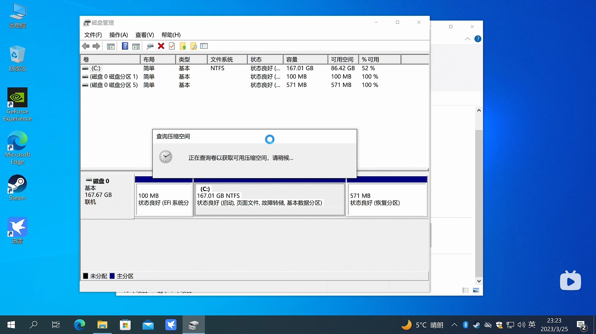
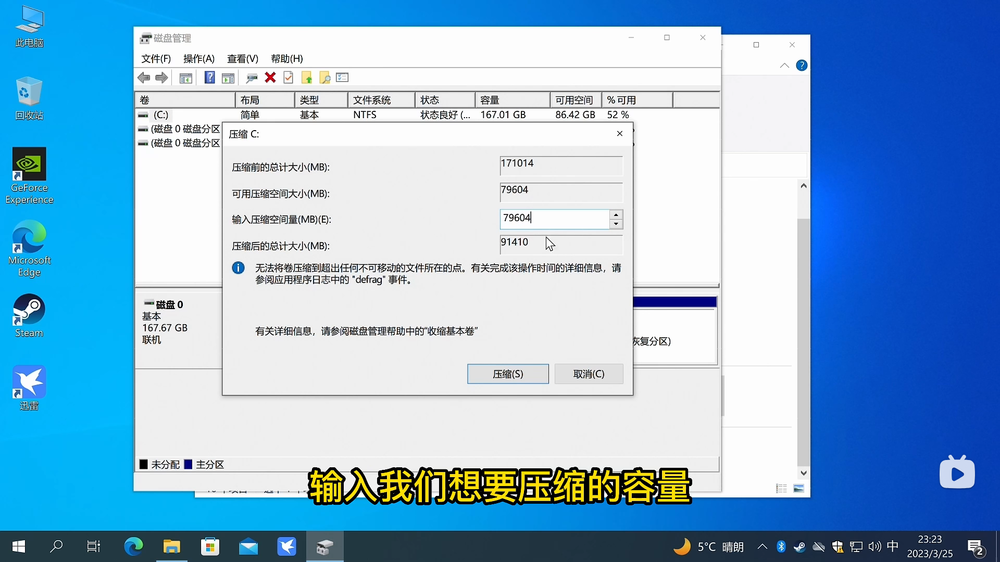
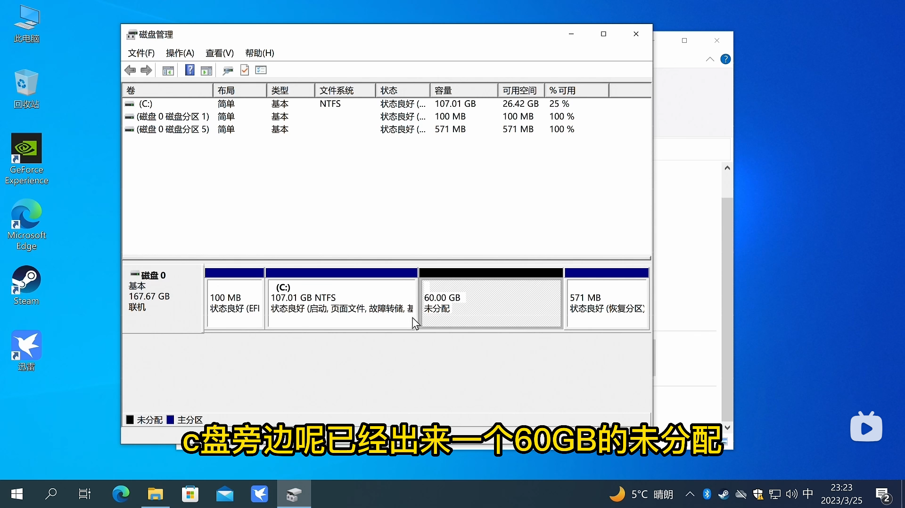
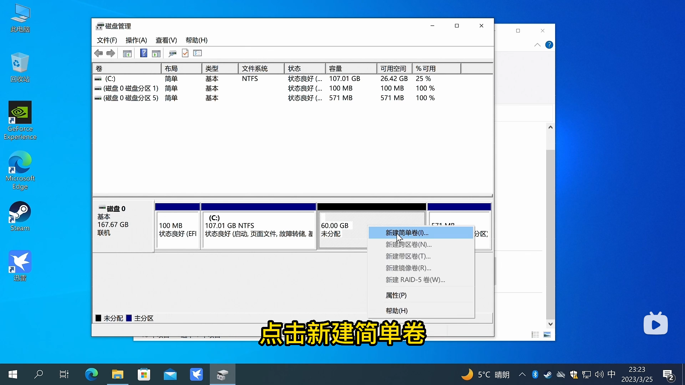
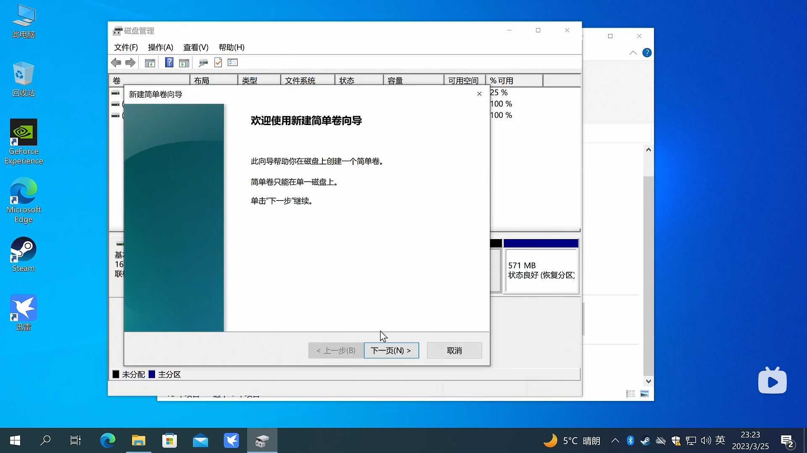
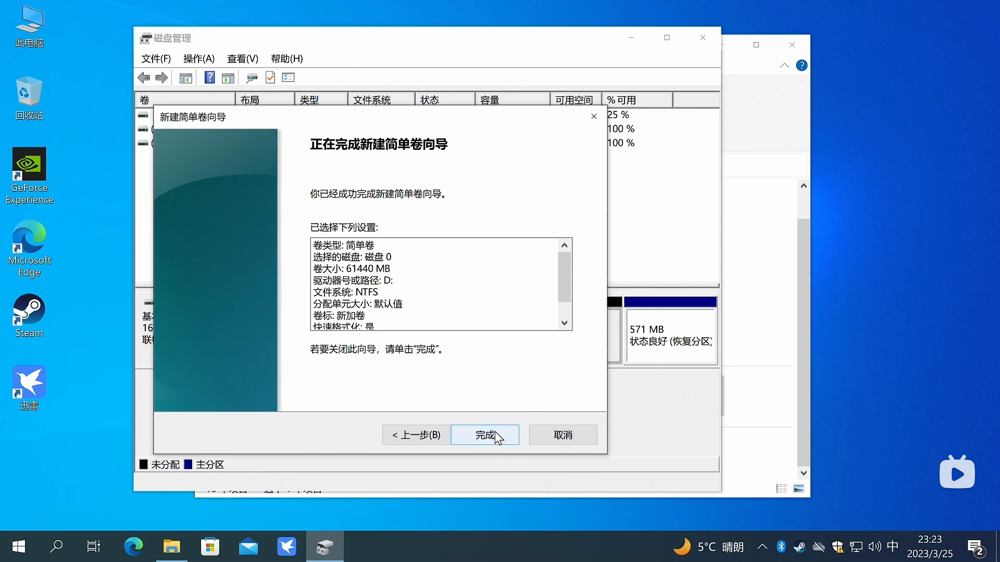

1. ###   磁盘分区 （以下内容来自B站up爱玩电脑的小老虎）

      1.先查看自己电脑的硬盘容量（例如C盘和D盘），以便找到自己需要分盘的磁盘

      2.在开始菜单点右键，然后再点击磁盘管理（下面图片例子是win10系统，win11也是一样的操作）

   

   3.随后我们找到C盘，右键点击C盘，选择压缩卷

   ps：这个时候可能等待时间有点长，属于正常现象

   4。在压缩空间量输入你想压缩的容量（也就是分盘的容量），先用__GB（想分的容量） x1024,把得数填进去，最后点压缩

   ps：效果如下图

   5.在（未分配）卷上点鼠标右键，点击新建简单卷

   6.向导指引出来后，不断点击下一步就行（想确认分盘的参数请慢慢点），最后点击完成

   7.随后我们可以看到C盘后多了个D盘，就完成了

