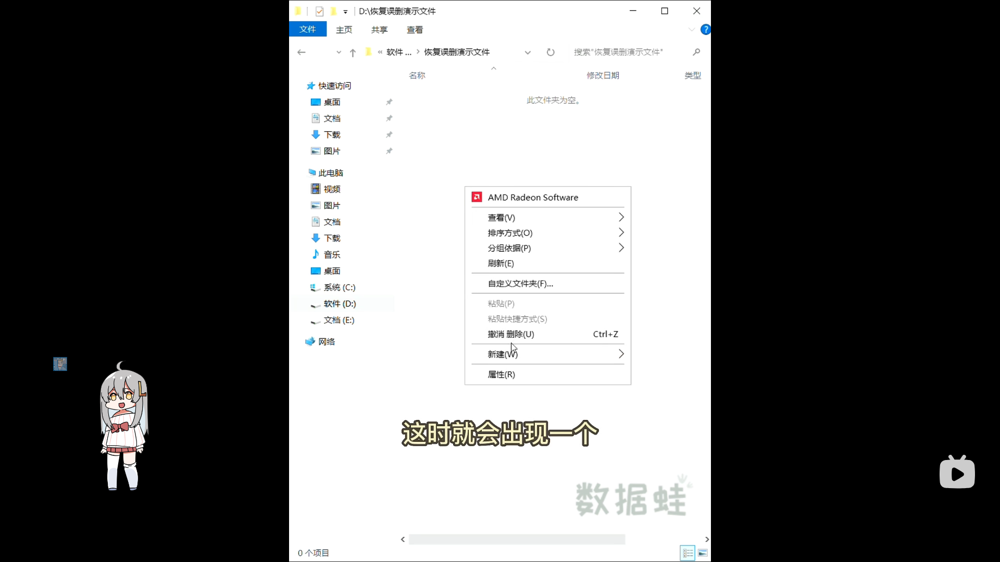

1. ###   误删文件找回

         1.如果只是误删了文件,还没进行其他操作,可以在如图界面点击鼠标右键,找到撤销删除.

   

   - 2.从回收站恢复:如果你的文件还没被彻底删除,双击回收站,找到你想要的文件,鼠标右键找到还原.即可恢复
   - 3.在义修软件大礼包中找到 数据恢复-万兴数据恢复-万兴数据恢复8.2版-万兴8.2免安装-Recoverit-Recoverit
   - 
