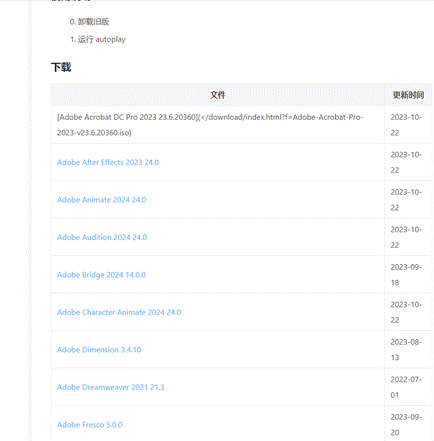
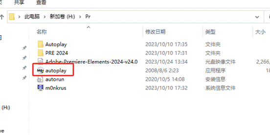
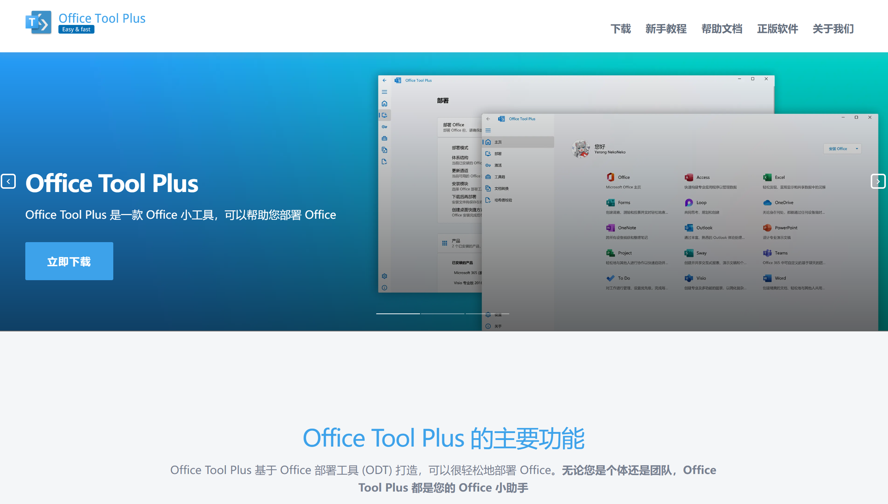
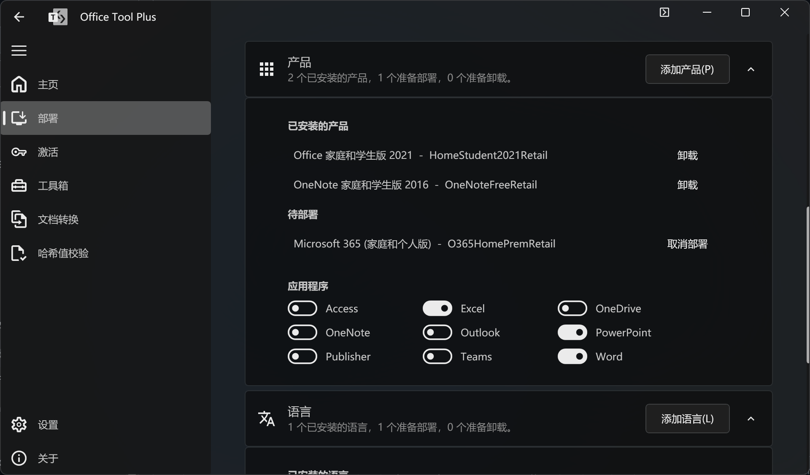

**安装软件****(Adobe,Office)**

1. 安装Adobe：

a.  进入网址：https://www.nite07.com/adobe/（本途径安装的Adobe软件仅供学习使用，如有版权需要，可选择官网下载付费激活https://www.adobe.com/cn/）

b.  选择对应Adobe软件进行安装

c.  下载好iso文件后直接解压，双击运行autoplay程序即可安装

d.  安装后无需激活即可使用（再次声明，本途径安装的Adobe软件仅供学习使用，如有版权需要，可选择官网下载付费激活https://www.adobe.com/cn/）

2.安装Ofice:

a.进入网址： [Office Tools Plus](https://otp.landian.vip/zh-cn/) 下载Office安装工具 
//如果财力足够或版权需要请前往 [Office官网](www.office.com) 购买正版

b.**解压** 下载的文件，打开Office Tools Plus.exe 选择 一键部署 的 Office 365（家庭和个人版）

c.前往部署页面，建议只选择 PowerPoint Excel Word 三件套。如有额外需要自行勾选。

d.点击开始部署待程序安装完成后激活Office即可使用. [点击前往查看激活教程](https://github.com/liyang8246/pcywwxzx-doc/blob/master/src/%E7%B3%BB%E7%BB%9F/%E6%BF%80%E6%B4%BB%E7%B3%BB%E7%BB%9F_Office.md)

