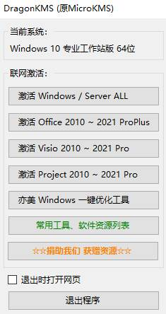
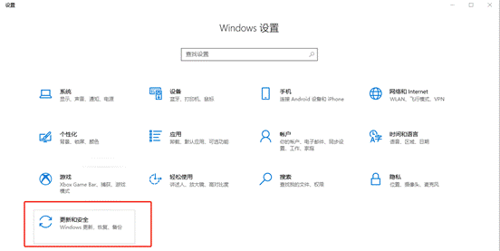
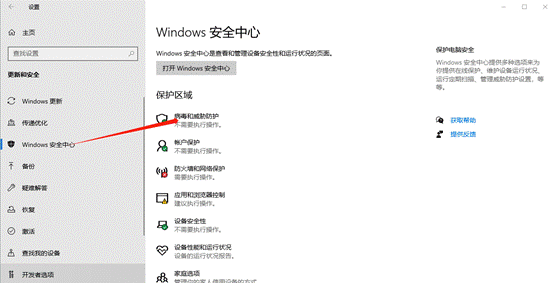
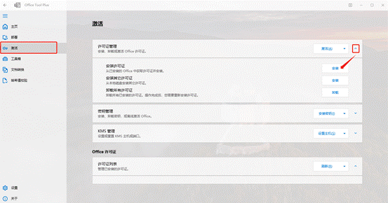
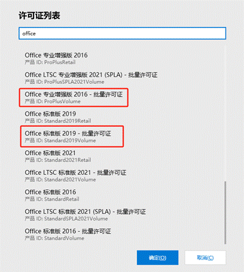
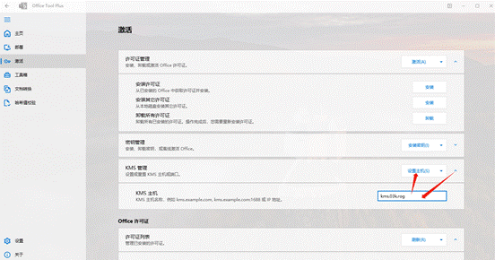

**激活系统****/Office**

激活系统

方式一

使用神龙KMS进行激活（有时会被电脑杀毒软件误删，具体操作见下文）

网址：http://www.yishimei.cn/network/319.html 该网址内讲述了使用方法。

若上述网址失效，以下为该网址内容转载：

DragonKMS下载地址1：https://wwod.lanzout.com/ix9Bo1c8yhpi

DragonKMS下载地址2：https://pan.baidu.com/s/1te0e12CBehHYsW61Vsw4QA?pwd=8888

若下载地址也失效，可以去义修群里要

关闭Windows Defender步骤：

打开设置，选择“更新和安全”

然后选择“Windows安全中心”，点击“病毒和威胁防护”。

点击管理设置，将右侧的“实时保护”、“云提供保护”、“自动提交样本”、“篡改保护”四项全部手动关掉

激活Office

下载软件：详见ii中Office Tool Plus的下载

激活：进入软件，点击左侧激活界面，在许可证管理一栏点击小箭头下拉菜单，点击安装许可证的安装按钮

选择与系统安装的Office版本吻合的批量许可证（Microsoft 365版本要选择office mondo 2016批量许可证）

点击确定后，在下方找到KMS管理一栏，点开下拉菜单，输入“kms.03k.org”后，点击设置主机

待右下角出现成功信息后，点击最上方激活按钮，静候佳音。若有错误代码，请检查许可证版本是否对应、KMS主机是否设置正确。成功后，进入任意Office软件，可以看到已经激活成功。

方式二

使用Microsoft数字权利激活方式激活(激活程序同样可被杀毒软件误删，激活前请进行相应预防工作)

此方法将欺骗性的硬件ID发给Microsoft以获取授权许可，在硬件发生更改的情况下将会失效

这里以云萌激活工具作为展示

下载地址:https://cmwtat.cloudmoe.com/cn.html?lengmao

此为激活工具的界面

