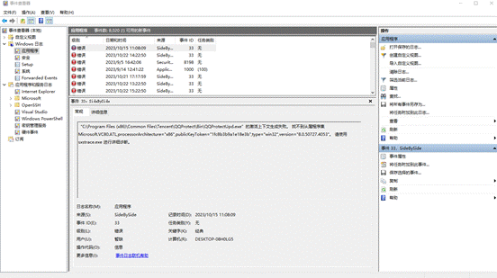
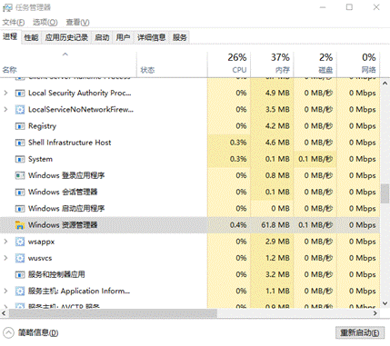

**蓝屏****/****死机**

5.1.1 **蓝屏：**

a.  Windows蓝屏情况是很常见的，当电脑进入蓝屏界面，我们通常可以在其界面查找到蓝屏代码。通过页面提示以及代码，我们可以大致定位问题根源。

b.  蓝屏问题通常集中在硬软件或驱动的不兼容、病毒等。在下文中提供了一些对应情况的常规解决方案。

c.  1.重启：有时只是某个程序或驱动程序一时犯错, 重启后他们会改过自新

d.  2.新硬件：首先, 应该检查新硬件是否插牢, 这个被许多人忽视的问题往往会引发许多莫名其妙的故障. 如果确认没有问题, 将其拔下, 然后换个插槽试试, 并安装最新的驱动程序. 同时还应对照微软网站的硬件兼容类别检查一下硬件是否与操作系统兼容. 如果你的硬件没有在表中, 那么就得到硬件厂商网站进行查询, 或者拨打他们的咨询电话.

e.  对于硬件方面的故障，也可以考虑下载对应软件进行烧机测试排除。能导致频繁蓝屏的硬件故障一般是CPU、内存、硬盘。

f.  3.新驱动和新服务：如果刚安装完某个硬件的新驱动, 或安装了某个软件, 而它又在系统服务中添加了相应项目(比如:杀毒软件、CPU降温软件、防火墙软件等), 在重启或使用中出现了蓝屏故障, 请到安全模式来卸载或禁用它们.

g.  4.检查病毒：比如冲击波和振荡波等病毒有时会导致Windows蓝屏死机, 因此查杀病毒必不可少. 同时一些木马间谍软件也会引发蓝屏, 所以最好再用相关工具进行扫描检查.

h.  5.检查BIOS和硬件兼容性：对于新装的电脑经常出现蓝屏问题, 应该检查并升级BIOS到最新版本, 同时关闭其中的内存相关项, 比如:缓存和映射. 另外 还应该对照微软的硬件兼容列表检查自己的硬件. 还有就是, 如果主板BIOS无法支持大容量硬盘也会导致蓝屏, 需要对其进行升级.

i.   6.电脑自查系统文件：以管理员身份启动cmd，输入sfc/scannow，令电脑自我检测系统文件是否异常。一般检测到问题后会进行修复，若无法修复，则考虑百度错误代码、使用Windows安装光盘对系统进行修复安装或重装（下策）。

j.   7.检查系统日志：在开始-->菜单中输入:EventVwr.msc, 回车出现"事件查看器", 注意检查其中的"系统日志"和"应用程序日志"中表明"错误"的项.

k.  8上网问（Baidu）：进入微软帮助与支持网站，搜索电脑对应停机码，如果没有合适信息，可以选择“英文知识库”再搜索。

l.   9.最后一次正确的配置： 重启系统, 在出现启动菜单时按下F8键就会出现高级启动选项菜单, 接着选择"最后一次正确配置"。面对系统软件或驱动更新引起的蓝屏，这种方法快捷有效。

m. 10.启动修复：

n.  电脑无法正常开机时，强制开机三次后再次开机，电脑会进入修复界面，可以选择相应选项修理。

o.  

p.  

q.  为面对不同的蓝屏情况，以下整理了一些常见代码及其原因（Ctrl+f一键查找），实际处理问题时建议多谨慎考虑或百度

| 代码                                           | 原因                                                         | 解决方案                                                     |
| ---------------------------------------------- | ------------------------------------------------------------ | ------------------------------------------------------------ |
| 0x0000000A:IRQL_NOT_LESS_OR_EQUAL              | 1.主要是由于安装了有缺陷或不兼容的硬件（BIOS)、驱动程序、软件产生。  2.当系统升级Windows到一个新版本时，由于设备驱动、系统服务、病毒扫描或备份工具与新版本不兼容产生。 | 上述2、3、5、8、9方案尝试排除                                |
| 0x00000012:TRAP_CAUSE_UNKNOWN                  | 未知                                                         | 既然微软都帮不上忙, 就得靠自己了, 请仔细回想这个错误是什么时候出现的;  第一次发生时你对系统做了哪些操作;  发生时正在进行什么操作. 从这些信息中找出可能的原因,  从而选择相应解决方案尝试排除 |
| 0x0000001A:MEMORY_MANAGEMENT                   | 这个内存管理错误往往是由硬件引起的,  比如: 新安装的硬件、内存本身有问题等. | 如果是在安装Windows时出现, 有可能是由于你的电脑达不到安装Windows的最小内存和磁盘要求. |
| 0x0000001E:KMODE_EXCEPTION_NOT_HANDLED         | Windows内核检查到一个非法或者未知的进程指令，这个停机码一般是由问题的内存或是与前面0x0000000A相似的原因造成的. | 1.     硬件兼容有问题:请对照前面提到的最新硬件兼容性列表, 查看所有硬件是否包含在该列表中.  2.     有问题的设备驱动、系统服务或内存冲突和中断冲突: 如果在蓝屏信息中出现了驱动程序的名字, 请试着在安装模式或者故障恢复控制台中禁用或删除驱动程序, 并禁用所有刚安装的驱动和软件. 如果错误出现在系统启动过程中, 请进入安全模式, 将蓝屏信息中所标明的文件重命名或者删除.  3.     如果错误信息中明确指出Win32K.sys: 很有可能是第三方远程控制软件造成的, 需要从故障恢复控制台中将对该软件的服务关闭.  4.     在安装Windows后第一次重启时出现:最大嫌疑可能时系统分区的磁盘空间不足或BIOS兼容有问题.  5.     如果是在关闭某个软件时出现的:很有可能是软件本身存在设计缺陷, 请升级或卸载它. |
| 0x00000023:FAT_FILE_SYSTEM                     | 0x00000023通常发生在读写FAT16或者FAT32文件系统的系统分区时, 而0x00000024则是由于NTFS.sys文件出现错误(这个驱动文件的作用是容许系统读写使用 .(NTFS文件系统的磁盘). 这两个蓝屏错误很有可能是磁盘本身存在物理损坏, 或是中断要求封包(IRP)损坏而导致的. 其他原因还包括:硬盘磁盘碎片过多; 文件读写操作过于频繁, 并且数据量非常大或者是由于一些磁盘镜像软件或杀毒软件引起的. | 第一步:首先打开命令行提示符, 运行"Chkdsk  /r"(注:不是CHKDISK, 感觉象这个, 但是它们所指的内容是不一样的)命令检查并修复硬盘错误, 如果报告存在坏道(Bad Track), 请使用硬盘厂商提供的检查工具进行检查和修复.  第二步:接着禁用所有即使扫描文件的软件,  比如:杀毒软件、防火墙或备份工具.  第三步:右击C:\winnt\system32\drivers\fastfat.sys文件并选择"属性", 查看其版本是否与当前系统所使用的Windows版本相符合.(注:如果是XP, 应该是C:\windows\system32\drivers\fastfat.sys)  第四步:安装最新的主板驱动程序, 特别IDE驱动. 如果你的光驱、可移动存储器也提供有驱动程序,  最好将它们升级至最新版. |
| 0x00000027:RDR_FILE_SYSTEM                     | 这个错误产生的原因很难判断,  不过Windows内存管理出了问题很可能会导致这个停机码的出现. | 如果是内存管理的缘故, 通常增加内存会解决问题.                |
| 0x0000002EATA_BUS_ERROR                        | 系统内存存储器奇偶校验产生错误,  通常是因为有缺陷的内存(包括物理内存、二级缓存或者显卡显存)时设备驱动程序访问不存在的内存地址等原因引起的.  另外, 硬盘被病毒或者其他问题所损伤,  以出现这个停机码. | 1.     检查病毒  2.     使用"chkdsk /r"命令检查所有磁盘分区.  3.     用Memtest86等内存测试软件检查内存.  4.     检查硬件是否正确安装, 比如:是否牢固、金手指是否有污渍. |
| 0x00000035:NO_MORE_IRP_STACK_LOCATIONS         | 从字面上理解, 应该是驱动程序或某些软件出现堆栈问题.  其实这个故障的真正原因应该是驱动程序本身存在问题,  或是内存有质量问题. | 请使用前面介绍的常规解决方案中与驱动程序和内存相关的方案进行排除. |
| 0x0000003F:NO_MORE_SYSTEM_PTES                 | 一个与系统内存管理相关的错误,  比如:由于执行了大量的输入/输出操作, 造成内存管理出现问题: 有缺陷的驱动程序不正确地使用内存资源;  某个应用程序(比如:备份软件)被分配了大量的内核内存等. | 卸载所有最新安装的软件(特别是哪些增强磁盘性能的应用程序和杀毒软件)和驱动程序. |
| 0x00000044:MULTIPLE_IRP_COMPLIETE_REQUESTS     | 通常是由硬件驱动程序引起的.                                  | 卸载最近安装的驱动程序                                       |
| 0x00000050:PAGE_FAULT_IN_NONPAGED+AREA         | 有问题的内存(包括物理内存、二级缓存、显存)、不兼容的软件(主要是远程控制和杀毒软件)、损坏的NTFS卷以及有问题的硬件(比如: PCI插卡本身已损坏)等都会引发这个错误. | 请使用前面介绍的常规解决方案中与内存、软件、硬件、硬盘等相关的方案进行排除. |
| 0x00000051:REGISTRY_ERROR                      | 这个停机码说明注册表或系统配置管理器出现错误,  由于硬盘本身有物理损坏或文件系统存在问题,  从而造成在读取注册文件时出现输入/输出错误. | 使用"chkdsk  /r"检查并修复磁盘错误.                          |
| 0x00000058:FTDISK_INTERNAL_ERROR               | 说明在容错集的主驱动发生错误.                                | 首先尝试重启电脑看是否能解决问题,  如果不行, 则尝试"最后一次正确配置"进行解决. |
| 0x0000005E:CRITICAL_SERVICE_FAILED             | 某个非常重要的系统服务启动识别造成的.                        | 如果是在安装了某个新硬件后出新的,  可以先移除该硬件, 并通过网上列表检查它是否与Windows  2K/XP兼容, 接着启动电脑, 如果蓝屏还是出现, 请使用"最后一次正确配置"来启动Windows, 如果这样还是失败, 建议进行修复安装或是重装. |
| 0x0000006F:SESSION3_INITIALIZATION-FAILED      | 这个错误通常出现在Windows启动时, 一般是由有问题的驱动程序或损坏的系统文件引起的. | 对应方法无效时尝试Windows 安装光盘对系统进行修复             |
| 0x00000076ROCESS_HAS_LOCKED_PAGES              | 通常是因为某个驱动程序在完成了一次输入/输出操作后, 没有正确释放所占有的内存 | 第一步:点击开始-->运行:regedt32, 找到[HKLM\SYSTEM\Currentcontrol  set\control\session manager\memory management], 在右侧新建双字节值"TrackLockedPages",  值为1. 这样Windows便会在错误再次出现时跟踪到是哪个驱动程序的问题.第二步:如果再次出现蓝屏, 那么错误信息会变成:STOP:0x0000000CB(0xY,0xY,0xY,0xY)DRIVER_LEFT_LOCKED_PAGES_IN_PROCESS其中第四个"0xY"会显示为问题驱动程序的名字,  接着对其进行更新或删除.第三步:进入注册表, 删除添加的"TrackLockedPages". |
| 0x00000077:KERNEL_STACK_INPAGE_ERROR           | 说明需要使用的内核数据没有在虚拟内存或物理内存中找到. 这个错误常常是磁盘有问题,  相应数据损坏或受到病毒侵蚀. | 使用杀毒软件扫描系统; 使用"chkdsk  /r"命令检查并修复磁盘错误, 如不行则使用磁盘厂商提供的工具检查修复. |
| 0x0000007A:KERNEL_DATA_INPAGE_ERROR            | 这个错误往往是虚拟内存中的内核数据无法读入内存造成的. 原因可能是虚拟内存页面文件中存在坏簇病毒、磁盘控制器出错、内存有问题. | 首先用升级为最新病毒库杀毒软件查杀病毒,  如果信息中还有0xC000009C或0xC000016A代码, 那么表示是坏簇造成的, 并且系统的磁盘检测工具无法自动修复,  这时要进入"故障恢复控制台", 用"chkdsk  /r"命令进行手动修复. |
| 0x0000007B:INACESSIBLE_BOOT_DEVICE             | Windows在启动过程中无法访问系统分区或启动卷. 一般发生在更换主板后第一次启动时, 主要是因为新主板和旧主板的IDE控制器使用了不同芯片组造成的. 有时也可能是病毒或硬盘损伤所引起的. | 一般只要用安装光盘启动电脑,  然后执行修复安装即可解决问题.  对于病毒则可使用DOS版的杀毒软件进行查杀(有kv2005DOS版下载). 如果是硬盘本身存在问题, 请将其安装到其他电脑中, 然后使用"chkdsk  /r"来检查并修复磁盘错误. |
| 0x0000007E:SYSTEM_THREAD_EXCEPTION_NOT_HANDLED | 系统进程产生错误, 但Windows错误处理器无法捕获. 其产生原因很多, 包括:硬件兼容性、有问题的驱动程序或系统服务、 或者是某些软件. | 请使用"事件查看器"来获取更多的信息, 从中发现错误根源.(发现好像不是解决哦, 看来这里大家要自力更生了!) |
| 0x0000007F:UNEXPECTED_KERNEL_MOED_TRAP         | 一般是由于有问题的硬件(比如:内存)或某些软件引起的. 有时超频也会产生这个错误. | 用检测软件(比如:Memtest86)检查内存, 如果进行了超频, 请取消超频. 将PCI硬件插卡从主板插槽拔下来,  或更换插槽. 另外, 有些主板(比如:nForce2主板)在进行超频后, 南桥芯片过热也会导致蓝屏,  此时为该芯片单独增加散热片往往可以有效解决问题. |
| 0x00000080:NMI_HARDWARE_FAILURE                | 通常是由于硬件引起的.(似乎蓝屏与硬件错误有不解之缘)          | 如果最近安装了新硬件, 请将其移除, 然后试试更换插槽和安装最新的驱动程序,  如果升级了驱动程序, 请恢复后原来的版本; 检查内存金手指是否有污染和损坏;  扫描病毒; 运行"chkdsk  /r"检查并修复磁盘错误; 检查所有硬件插卡已经插牢.  如果以上尝试都无效果, 就得找专业的电脑维修公司请求帮助了. |
| 0x0000008E:KERNEL_MODE_EXCEPTION_NOT_HANDLED   | 内核级应用程序产生了错误,  但Windows错误处理器没有捕获. 通常是硬件兼容性错误. | 升级驱动程序或升级BIOS.                                      |
| 0x0000009C:MACHINE_CHECK_EXCEPTION             | 通常是硬件引起的. 一般是因为超频或是硬件存在问题(内存、CPU、总线、电  源). | 如果进行了超频, 请降下CPU原来频率, 检查硬件.                 |
| 0x0000009FRIVER_POWER_STATE_FAILURE            | 往往与电源有关系, 常常发生在与电源相关的操作,  比如:关机、待机或休睡. | 重装系统, 如果不能解决, 请更换电源.                          |
| 0x000000A5:ACPI_BIOS_ERROR                     | 通常是因为主板BIOS不能全面支持ACPI规范.                      | 如果没有相应BIOS升级, 那么可在安装Windows 2K/XP时, 当出现"press F6 if  you need to install a third-party SCSI or RAID driver"提示时, 按下F7键, 这样Windows便会自动禁止安装ACPI HAL, 而安装 Standard PC HAL. |
| 0x000000B4:VIDEO_DRIVER_INIT_FAILURE           | 这个停止信息表示Windows因为不能启动显卡驱动, 从而无法进入图形界面. 通常是显卡的问题, 或者是存在与显卡的硬件冲突(比如:与并行或串行端口冲突). | 进入安全模式查看问题是否解决,  如果可以, 请升级最新的显卡驱动程序,  如果还不行, 则很可能是显卡与并行端口存在冲突,  需要在安全模式按下WIN+break组合键打开"系统属性", 在硬件-->设备管理器中找到并双击连接打印的LPT1端口的选项, 在"资源"选项卡中取消"使用自动配置"的勾选, 然后将"输入/输出范围"的"03BC"改为"0378". |
| 0x000000BE:ATTEMPTED_WRITE_TO_READONLY_MEMORY  | 某个驱动程序试图向只读内存写入数据造成的.  通常是在安装了新的驱动程序,  系统服务或升级了设备的固件程序后. | 如果在错误信息中包含有驱动程序或者服务文件名称,  请根据这个信息将新安装的驱动程序或软件卸载或禁用. |
| 0x000000C2:BAD_POOL_CALLER                     | 一个内核层的进程或驱动程序错误地试图进入内存操作.  通常是驱动程序或存在BUG的软件造成的. | 请参考前面介绍的常规解决方案相关项目进行排除.                |

5.1.2 **死机：**

a.  任务栏卡死：Ctrl+Alt+Delete后选择任务管理器，在进程中选中Windows资源管理器，右键重启即可

b.   

c.   同时开太多程序或程序卡死：同时运转太多程序，可能会造成内存、CPU占用高，从而导致电脑卡顿。也可能是流氓软件（详见iii）强制运行占用资源。

i.    同样打开任务管理器，选中卡死的软件强制重启。或选择管理器中“性能”选项，点击下方“资源监视器”，即可看到各程序占用情况。

ii.  温馨提醒：如果任务管理器也卡死，可以长按电源再来一遍（可能造成数据丢失）

iii. 软件不兼容：有时候同学们抱怨游戏打一半死机，或者电脑用一半卡住，可能是使用的软件与电脑的软硬件产生冲突或不兼容。特别是某些吃配置的软件，如大型游戏、渲染或建模软件等。这是可以去网上获取对应软件的配置要求。

d.  电脑基本无响应，卡死：一般情况只能强制重启找原因，但可能造成数据丢失。

i.  电脑积灰，让硬件部王凯清灰即可

ii.  硬件问题，如内存没插稳，可跑程序测试。CPU温度过高，一般伴有蓝瓶钙等症状。确认问题可以检查超频、散热风扇和硅脂损耗等，如有问题，让硬件部王凯修理即可

iii. C盘空间不足。右键选中C盘，点击属性，点击磁盘清理；或使用相关软件清理。

e.  电脑中病毒了：使用杀毒软件即可

f.  有时电脑睡眠息屏后按键盘鼠标无法唤醒，关机键也无响应，一般需强制重启。

i.  1.检查电脑内存，内存不足也会导致无法正常唤醒

1. 2.禁用快速启动功能：快速启动的运行原理主要是利用了系统休眠技术和引导程序优化。具体来说，当用户使用快速启动时，Win10系统将会把当前的系统状态保存到硬盘中，然后在下次启动时，系统会从硬盘中恢复这些状态，而不是完全重新启动。通过这种方式，Win10系统可以显著缩短启动时间，提高启动效率和速度。

a. 然鹅这么做有时会引发一些奇怪的问题，如无法关机，可以尝试禁用来解决问题。

ii.  按下Win + X键，选择“电源选项”，点击其他电源设置

iii. 在电源选项中，点击“选择电源按钮的功能”

iv. 点击“更改当前不可用选项”

v.  在关机设置下，取消选中“启用快速启动（推荐）”选项

vi. 点击“保存更改”按钮

