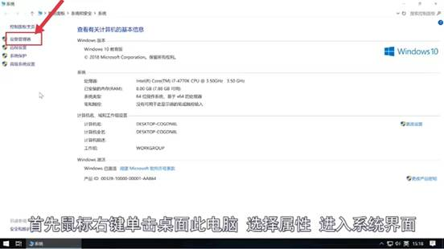
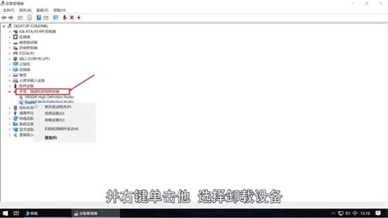
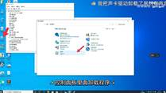
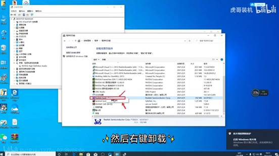
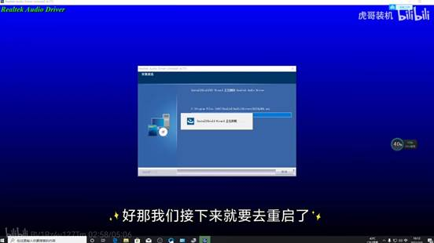
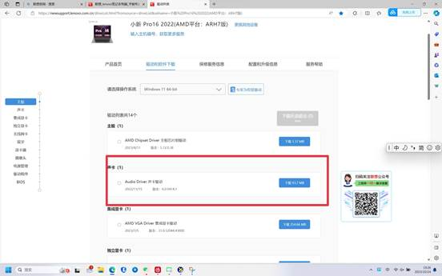
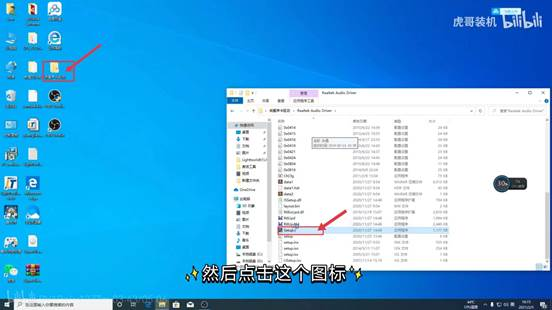

**安装****/****卸载声卡驱动**

1. 1、卸载声卡驱动：

a.  首先鼠标右键单击桌面此电脑，选择属性然后点击设备管理器.

b.  点击声音视频和游戏控制器，右键点击Realtek，选择卸载设备，但先别重启.

i.  打开控制面板，点击卸载程序.

ii.  找到Realtek开头的，然后右键点击它然后点击卸载 ，卸载后要拔掉网线.

iii. 卸载完看看有没有卸干净没有要继续卸，卸完后拔掉网线重启，卸干净后再把网线插上.

iv. 2、安装声卡驱动：

v.  进入该品牌的官网搜索对应的声卡驱动，然后下载这个驱动程序的安装包。

1. 点击安装包然后打双击如图的图标，安装，然后重启之后就好咯.

vi.  