**安装****/****卸载显卡驱动**

1. 1、安装显卡驱动（以英伟达为例）：
2. 首先，找到此电脑右键点开属性，查看自己的系统版本

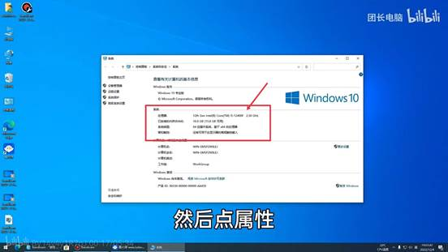

3. 然后去浏览器输入网址www.nvidia.cn,然后点击右上角驱动程序

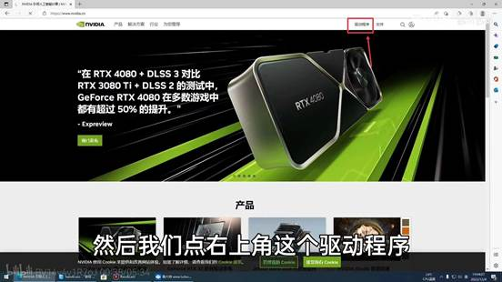

4. 输入显卡的产品型号等信息，然后就有对应的驱动可以下载，

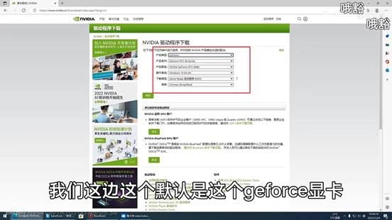

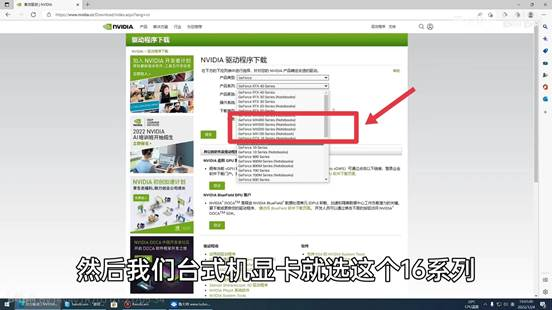

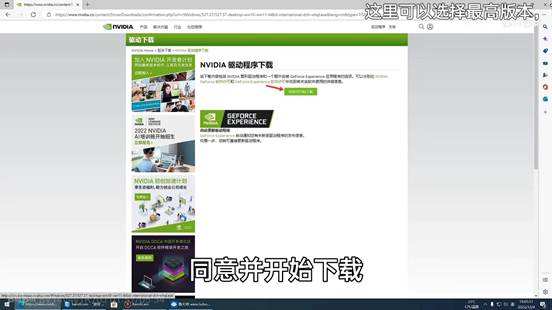

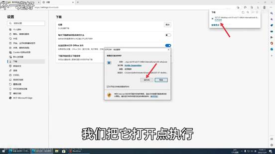

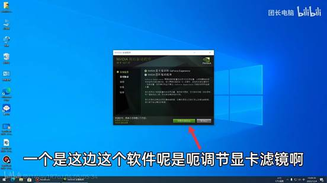

5. 选择自定义，然后下一步.

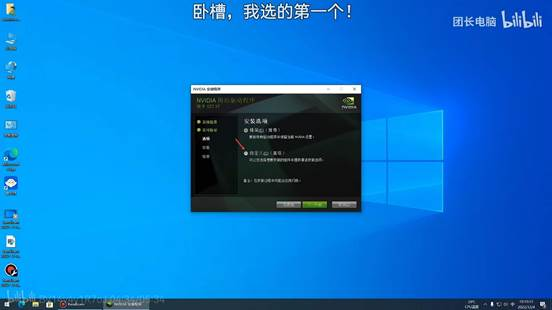

6. 选择执行清洁安装，系统就会帮你删除上一个版本的驱动，点击下一步就能安装咯.

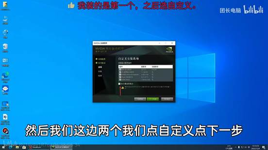

7. 2、卸载显卡驱动：
8. 首先下载DDU软件并解压.
9. 然后进入安全模式：win+R之后在窗口输入msconfig.

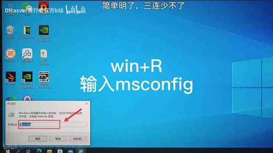

a.  点击引导，把安全引导前面的勾打上，然后点击确定.

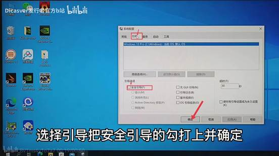

b.  然后点击重新启动.

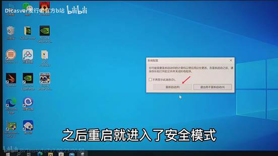

c.  重启完后，电脑进入安全模式，这时我们打开DDU，然后选择显卡和你的显卡品牌，然后点击清除并重启.

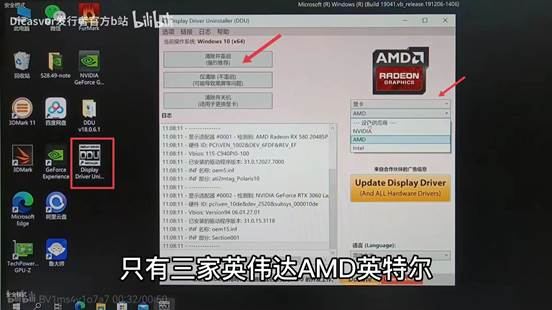

d.  在电脑清除的时候，也就是重启前，我们要先进入win+R之后在窗口输入msconfig，然后关闭安全模式之后先点击应用再点击确定.

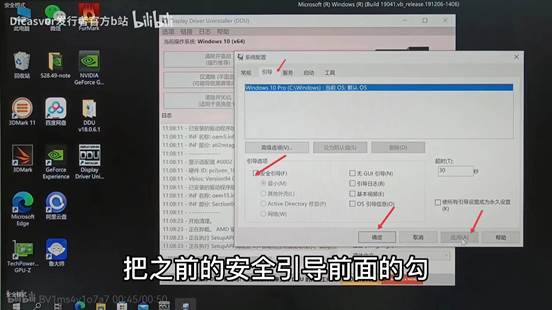

e.  然后点击退出而不重新启动，等电脑卸载就好了.

