**安装****/****卸载网卡驱动**

1. 1、安装网卡驱动：
2. 如果安装网卡驱动前没网，这时我们可以利用手机和一条该手机的充电线，在确保手机联网的状态下，用充电线把手机与电脑连接起来，如图.

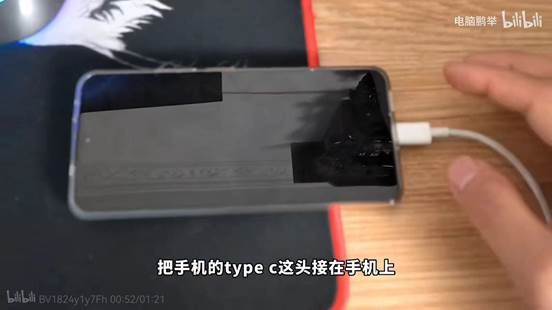

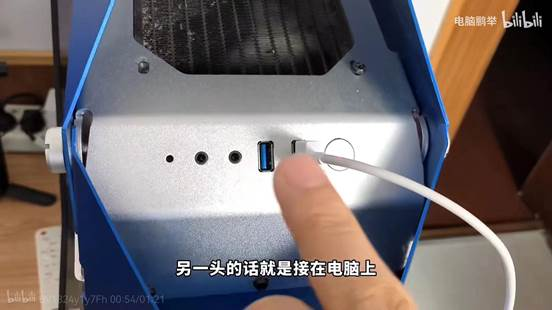

3. 打开手机设置，点击类似”连接与共享“的字样，然后点击个人热点，并打开USB网络共享，就成功了.

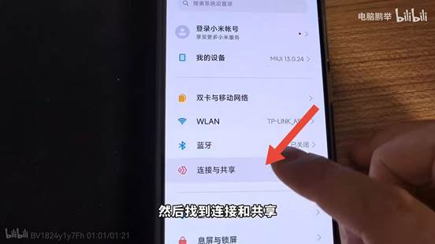

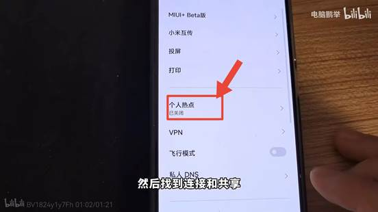

4. 然后打开百度搜索你的电脑品牌并进入官网.

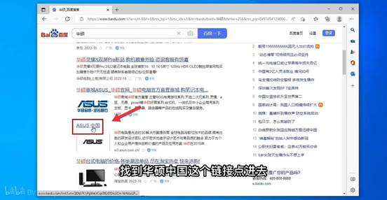

5. 找到服务支持并点击然后点击下载中心.

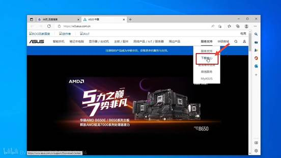

6. 输入你的产品型号，并点击”驱动程序和工具软件“.

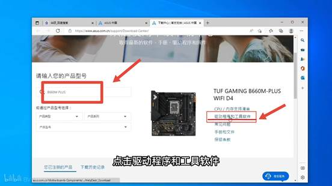

7. 选择你的系统版本.

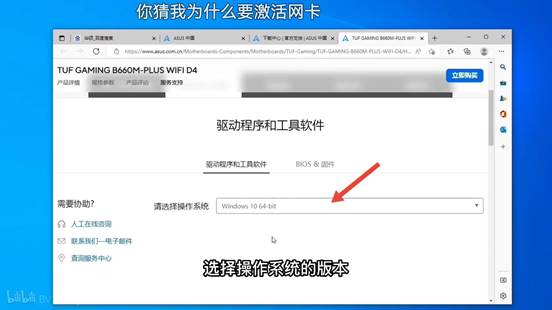

8. 点击下载无线网络驱动程序，然后等几分钟，就可以在设备管理器找到网络适配器找到下载的驱动了

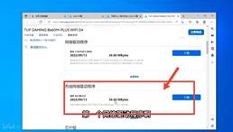

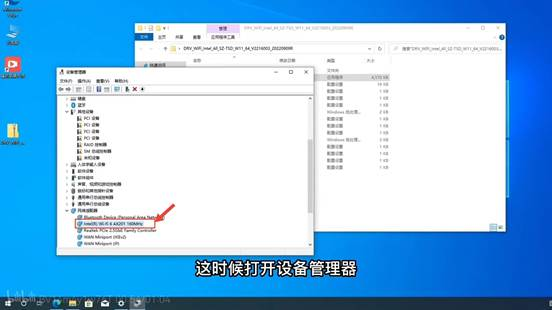

9. 2、卸载网卡驱动：
10. 找到此电脑右键，找到管理并点进去.

11. 在系统工具里找到设备管理器，点进去，然后找到网络适配器.

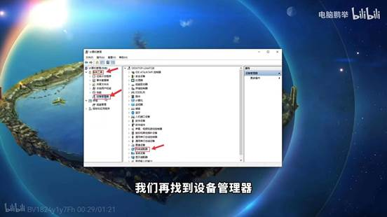

12. 在网络适配器中找到已安装的网卡驱动然后右键，就能找到“卸载设备”，点击便能卸载网卡驱动.

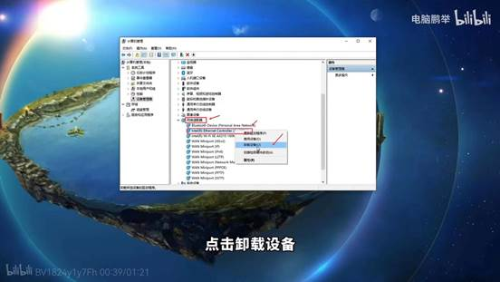