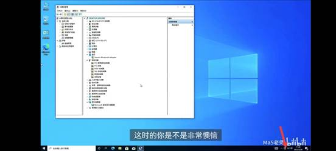
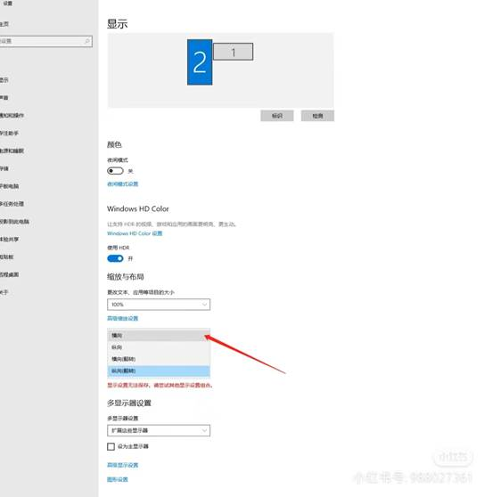

**常见驱动问题体现**

1. 1、电脑无法连接网络或显示网络异常.

2. 2、电脑无法识别网卡或显示网卡缺少驱动.
3. 3、电脑网速慢或不稳定. 
4. 4、计算机无法正常开机，表现为主机运行，但是屏幕处于黑暗状态.
5. 5、显示画面怪异，分辨率不正常，造成图像模糊或扭曲.
6. 6、Windows系统运行起来会感觉明显卡机，但不会死机.
7. 7、玩游戏的时候卡顿或无法进入游戏.
8. 8、运行PS或视频处理软件时会出现运行超级慢的感觉.
9. 9、有可能会出现莫名其妙的系统蓝屏事件.
10. 10、会导致显示设置不正确或参数无法调整.

11. 11、计算机没有声音.